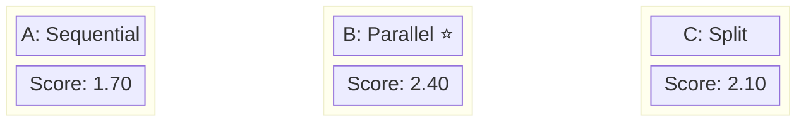
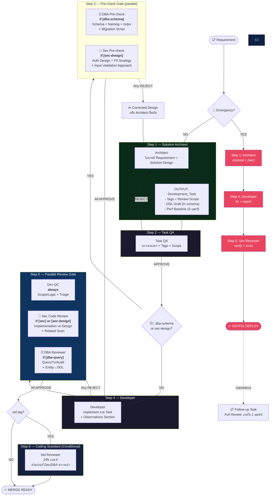
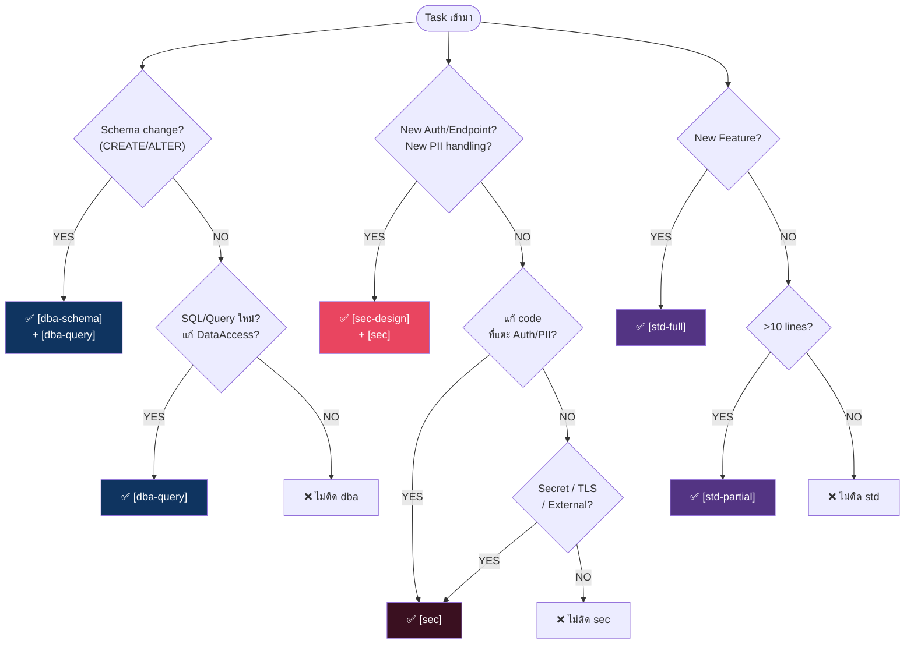
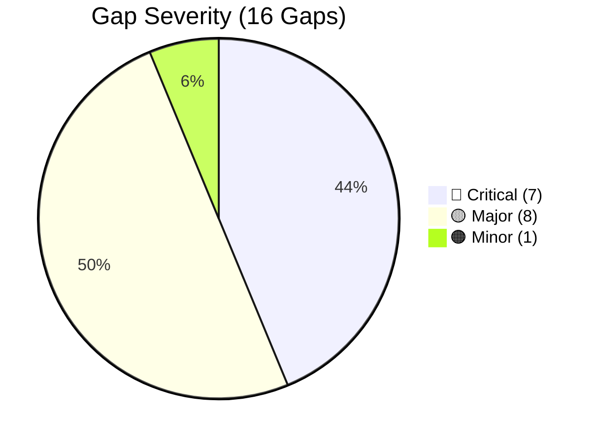
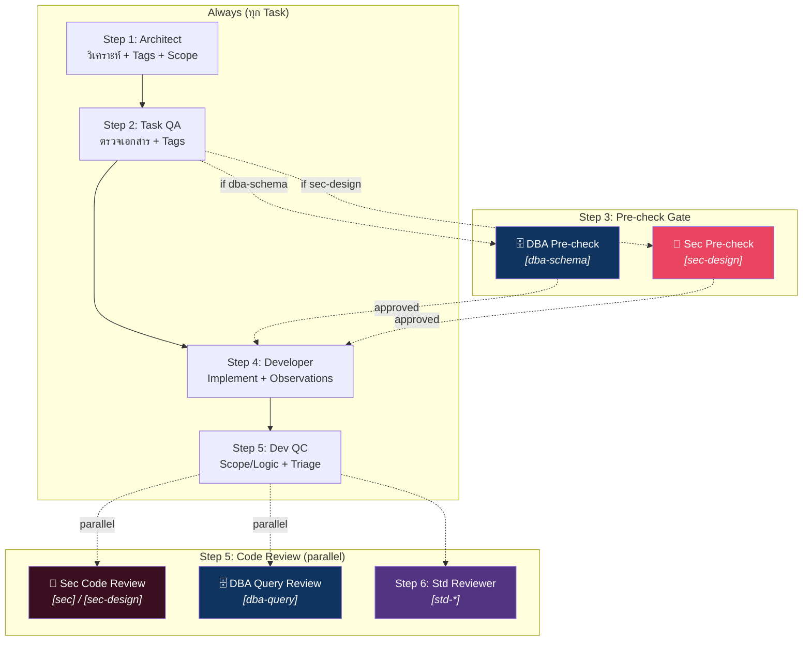
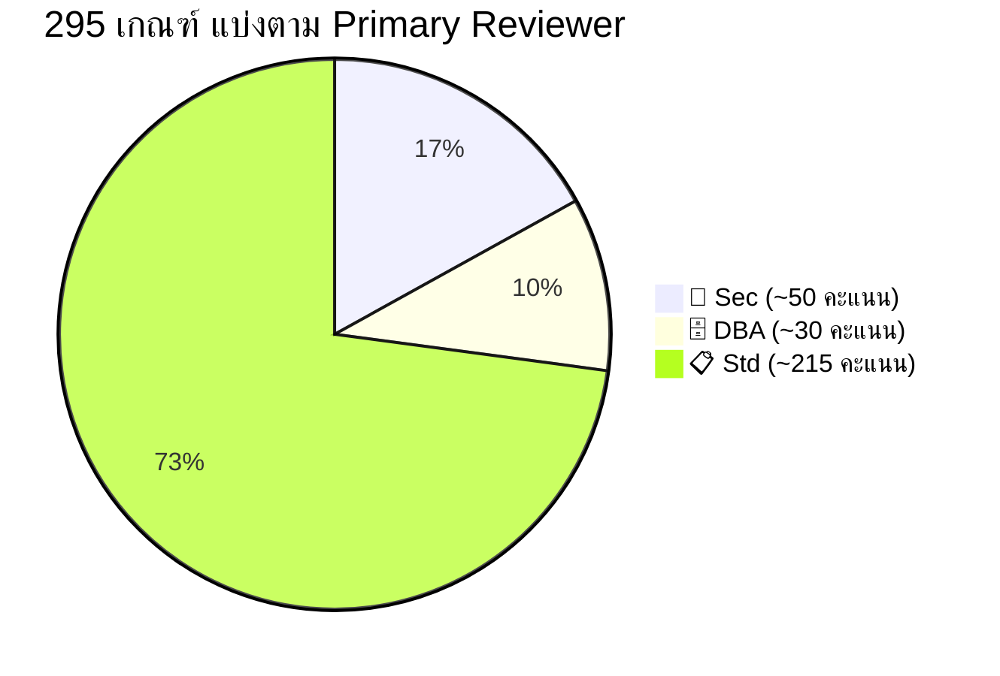
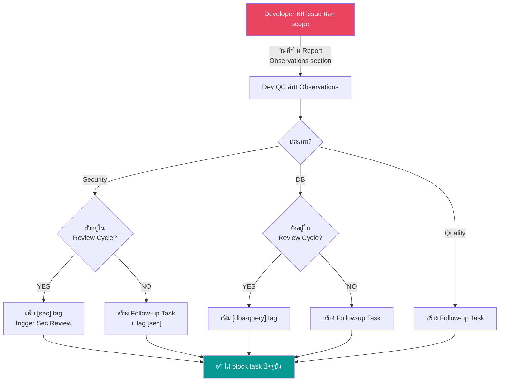

# 🔬 Role-Research: Security & DBA Reviewer — Pipeline Design

> **วันที่วิจัย:** 16 มีนาคม 2026 | **โปรเจคอ้างอิง:** `ESTATEMENT_API` (ASP.NET Core 3.1 + MySQL + AS400)  
> **สถานะ:** ✅ ผ่าน 7 Scenario Tests — ปิด 16 Gaps ครบ | **อ้างอิง:** `Role-Plan.md`

---

## 1. Tech Stack จาก ESTATEMENT_API

| Layer | Technology | Sec/DB Concern |
|-------|-----------|:-:|
| Framework | ASP.NET Core 3.1, N-Layer (Controller → Service → DataAccess) | — |
| Auth | JWT Bearer + `[Authorize]` | 🔐 |
| Database | MySQL × 2 DBs via EF Core + UnitOfWork NuGet | 🗄️ |
| External | AS400 Mainframe via Socket | 🔐🗄️ |
| Deploy | Jenkins (3 env) + Docker + K8s | — |

### Security Touchpoints ที่พบจาก Code

| รหัส | จุดพบ | ระดับ | §§ |
|:----:|-------|:-----:|:--:|
| S1 | JWT Key อยู่ใน appsettings ไม่ใช่ Vault | ⚠️ | §7.2 |
| S2 | Input validate แบบ manual (`IsNullOrEmpty`) ไม่มี FluentValidation | ⚠️ | §15 |
| S3 | `ex.ToMessage()` → **Stack trace leak** กลับ client (หลายไฟล์) | 🔴 | §8.6 |
| S4 | PII (email, idCard, mobileNo) ไม่มี masking | 🔴 | §16.4 |
| S5 | **Hard-coded test data** `11111111`–`99999999` bypass logic ใน Production | 🔴 | — |
| S6 | Connection string ใน config ไม่ใช่ Vault | ⚠️ | §3.21 |

### Database Touchpoints ที่พบจาก Code

| รหัส | จุดพบ | ระดับ | §§ |
|:----:|-------|:-----:|:--:|
| D1 | ใช้ EF Core + UoW NuGet (ห้ามใน Standard ใหม่ §3.30) | ⚠️ | §3.30 |
| D2 | PK ใช้ GUID base64 ไม่ standard | ⚠️ | — |
| D3 | `SaveChanges()` ไม่มี explicit transaction | ⚠️ | §3 |
| D4 | INSERT ไม่มี audit log (Who/What/When) | 🔴 | §3.27 |
| D5 | ไม่มี migration scripts ใน `dbs/` | 🔴 | — |
| D6 | AS400 = external → DBA ตรวจ SQL ภายในไม่ได้ | ⚠️ | — |

### Key Insight

```
Security design ผิดหลัง code = rewrite (Auth scheme, PII strategy) → Sec Pre-check อยู่ "ก่อน" Developer
Security implementation ต้องเห็น code จริง (S3, S5)                → Sec Code Review อยู่ "หลัง" Developer
DB Schema ผิดหลัง code = rewrite (D5, D2)                       → DBA Pre-check อยู่ "ก่อน" Developer
DB Query/Transaction ตรวจจาก code (D3, D4)                       → DBA Query อยู่ "หลัง" Developer
★ Sec และ DBA มีโครงสร้างเหมือนกัน: Pre-check (design) ก่อน Dev + Code Review หลัง Dev
```

---

## 2. Flow Design — เปรียบเทียบ 3 แนวทาง



| เกณฑ์ (น้ำหนัก) | A: Sequential | B: Parallel | C: Split |
|-----------------|:-:|:-:|:-:|
| Cycle Time (30%) | 🔴 ช้า | 🟢 **เร็วสุด** | 🟡 กลาง |
| DBA จับ Schema ก่อน code (25%) | ❌ | ❌ | ✅ |
| Sec เห็น code จริง (15%) | ✅ | ✅ | ✅ |
| ซับซ้อน (15%) | 🟢 ง่าย | 🟡 กลาง | 🔴 ซับซ้อน |
| Reject ง่าย (10%) | 🟡 | 🟢 | 🔴 |
| **Weighted** | **1.70** | **2.40** | **2.10** |

> **เลือก: Hybrid B+C** — ใช้ Parallel (B) เป็นหลัก + DBA Pre-check จาก (C) สำหรับ Schema Change

---

## 3. Revised Flow (ฉบับสมบูรณ์)

> **Design Principles:**
> - Architect ออกก่อนเสมอ — output (Tags + Scope + DDL Draft + Sec Design) กำหนดว่า DBA/Sec จะได้รับ task ไหน ตรวจอะไร
> - QA ตรวจเอกสาร **ก่อน** Pre-check ทำงาน — ป้องกัน DBA/Sec ทำเสียเปล่าถ้า Task โดน Reject
> - DBA/Sec **สมมาตรกัน** — ทั้งคู่มี Pre-check (design, ก่อน Dev) + Code Review (implementation, หลัง Dev)



---

## 4. Architect Decision — Tags & Scope (กำหนดตั้งแต่ Step 1)



> **sec-design vs sec:**
> - `[sec-design]` = **Structural** — New endpoint + Auth, New PII handling → ต้อง Pre-check design ก่อน Dev (auto-add [sec])
> - `[sec]` only = **Code-level** — แก้ code ที่แตะ Auth/PII เดิม (design มีอยู่แล้ว) → ตรวจแค่ code หลัง Dev
>
> **R1:** ทุก Tag ต้องมี **Review Scope** กำกับ

---

## 5. Scenario Audit — ทดสอบ 7 กรณี จับ 16 Gaps



| # | Scenario | Tags | Gaps พบ | ตัวอย่าง Gap |
|---|---------|------|:-------:|-------------|
| S1 | เปลี่ยน error message | — | 0 | ✅ ไม่มี |
| S2 | เพิ่ม endpoint + Input ใหม่ | `[sec]` | 2 | Architect ติด tag ไม่มี scope / Dev เพิ่ม DB write นอกเอกสาร |
| S3 | สร้าง Table + Feature ใหม่ | `[dba-*]` `[sec]` `[std]` | 4 | Entity ไม่ตรง DDL / DBA Reject loop / EF Core vs SQL / Std ตรวจซ้ำ |
| S4 | Optimize query ช้า | `[dba-query]` | 3 | QA ตรวจ perf ไม่ได้ / ไม่มี baseline / AS400 ตรวจไม่ได้ |
| S5 | Security Hotfix | `[sec]` | 2 | Sec ตรวจแค่จุดเดียว / Hotfix ช้าเกิน |
| S6 | เพิ่ม Column ใน Table เดิม | `[dba-*]` | 3 | Migration ไม่ตรวจ / Backward compat / Existing data |
| S7 | แก้ Logic มี legacy test data | — | 2 | Legacy risk หลุด pipeline / Dev QC ไม่มีสิทธิ์ escalate |

---

## 6. Gap Resolution — 12 Revision Rules

```mermaid
flowchart LR
    subgraph GAPS ["16 Gaps"]
        G_CRIT["🔴 7 Critical"]
        G_MAJ["🟡 8 Major"]
        G_MIN["🟠 1 Minor"]
    end

    subgraph RULES ["12 Revision Rules"]
        R1["R1: Architect ระบุ<br/>Review Scope"]
        R2["R2: Dev QC เพิ่ม<br/>tag ย้อนหลัง"]
        R3["R3: DBA Reject ให้<br/>Corrected DDL"]
        R4["R4: DBA output<br/>Migration Script"]
        R5["R5: DBA-Query เทียบ<br/>Entity↔DDL"]
        R6["R6: Sec สแกน<br/>Related Pattern"]
        R7["R7: Std ข้ามส่วน<br/>ที่ตรวจแล้ว"]
        R8["R8: Dev เพิ่ม<br/>Observations"]
        R9["R9: Observation<br/>Escalation Path"]
        R10["R10: Fast Track<br/>Hotfix Mode"]
        R11["R11: DBA รองรับ<br/>EF Core + External"]
        R12["R12: Architect ระบุ<br/>Perf Baseline"]
    end

    GAPS --> RULES
    RULES --> RESULT["✅ 16/16 ปิดครบ"]

    style RESULT fill:#079992,color:#fff
```



| Rule | ปิด Gap | สิ่งที่เปลี่ยน |
|:----:|:-------:|-------------|
| **R1** | G1 | Architect ต้องระบุ **Review Scope** (§§ + คำอธิบาย) ทุกครั้งที่ติด tag |
| **R2** | G2, G16 | Dev QC มีสิทธิ์ **เพิ่ม tag ย้อนหลัง** + สร้าง Follow-up Task |
| **R3** | G4 | DBA Reject → **ส่ง Corrected DDL กลับ** (Architect แค่ยืนยัน ไม่ต้องออกแบบเอง) |
| **R4** | G12-G14 | DBA Pre-check output = **Migration Script** + Backward Compat + Data Impact |
| **R5** | G3 | DBA-Query **เทียบ Entity ↔ DDL** ที่ Pre-check approve |
| **R6** | G10 | Sec **สแกน Related Pattern** ทั้ง codebase → Related Findings (ไม่ block) |
| **R7** | G6 | Std Reviewer **รับ Sec/DBA Report → ข้าม §§ ที่ตรวจแล้ว** |
| **R8** | G15 | Developer Report **บังคับมี Observations** (Security/DB/Quality — กรอก "None" ถ้าไม่พบ) |
| **R9** | G15-G16 | Dev QC อ่าน Observations → **Escalate**: เพิ่ม tag / สร้าง Follow-up |
| **R10** | G11 | **Fast Track**: Arch → Dev → Sec (ข้าม QA+QC) สำหรับ Production incident |
| **R11** | G5, G9 | DBA รองรับ **Dapper + EF Core (LINQ) + External System** (calling pattern) |
| **R12** | G8 | Architect ระบุ **Performance Baseline** (ก่อน/หลัง/วิธีวัด) ถ้า perf task |

---

## 7. Role Registry & Review Scope Matrix



### ใครตรวจอะไร (Primary — ไม่ซ้ำกัน)

| Concern | Dev QC | 🔐 Sec-Pre | 🔐 Sec-Code | 🗄️ DBA-Pre | 🗄️ DBA-Query | Std |
|---------|:------:|:---------:|:----------:|:----------:|:------------:|:---:|
| Logic/Scope ถูกตาม Task | ✅ | | | | | |
| Observation Triage | ✅ | | | | | |
| Entity ↔ DDL match | basic | | | | ✅ | |
| Auth Scheme, Authz Policy | | ✅ | | | | |
| PII Strategy, Input Rules | | ✅ | | | | |
| Auth/Validation Implementation | | | ✅ | | | |
| Error Leak, Secret, PII in Code | | | ✅ | | | |
| Test Data Bypass, TLS | | | ✅ | | | |
| Related Pattern Scan | | | ✅ | | | |
| Schema Design, Naming | | | | ✅ | | |
| Index, Migration, Rollback | | | | ✅ | | |
| Backward Compat, Data Impact | | | | ✅ | | |
| Query Performance, N+1 | | | | | ✅ | |
| Transaction, Audit Log | | | | | ✅ | |
| Connection Pool, EF/Dapper | | | | | ✅ | |
| Code Naming §2, Format §14 | | | | | | ✅ |
| Structure §1, DI §11 | | | | | | ✅ |
| Testing §12, Async §3.12 | | | | | | ✅ |
| API Design §10,§13, YAGNI §20 | | | | | | ✅ |

### Coding Standard §§ แบ่งตาม Reviewer



| Reviewer | §§ ที่รับผิดชอบ |
|----------|----------------|
| 🔐 **Sec** | §3.6 (SQL Injection), §3.21-3.23 (ConnSec), §7 (Auth), §8.6 (Error Leak), §9 (Secret), §15 (Validation), §16.4 (PII), §18-§19 (Advanced Sec) |
| 🗄️ **DBA** | §3.16-3.20 (Timeout), §3.24-3.27 (Pool/Audit), §17 (Performance) |
| 📋 **Std** | ที่เหลือทั้งหมด: §1-§2, §3.1-3.15, §3.28-3.30, §4-§6, §8, §10-§14, §16, §20-§26 |

---

## 8. Document Flow & Folder Structure

```mermaid
flowchart LR
    subgraph ARCH_OUT ["Step 1: Architect Output"]
        DT["Development_Task_{ID}.md<br/><i>+ Tags + Scope + DDL + Sec Design</i>"]
    end

    subgraph QA_OUT ["Step 2: Task QA"]
        QR["Task_QA_Report_{ID}.md"]
    end

    subgraph PRECHECK_OUT ["Step 3: Pre-check Gate (parallel)"]
        DP["DBA_Precheck_{ID}.md<br/>+ Migration_Script_{ID}.sql"]
        SP["Sec_Precheck_{ID}.md<br/>+ Approved Auth/PII Design"]
    end

    subgraph DEV_OUT ["Step 4: Developer"]
        CODE["💻 Code Changes"]
        DR["Development_Report_{ID}.md<br/><i>+ Observations</i>"]
    end

    subgraph REVIEW_OUT ["Step 5: Parallel Review Gate"]
        QC["Dev_QC_Report_{ID}.md"]
        SR["Security_Review_{ID}.md"]
        DBR["DBA_Review_{ID}.md"]
    end

    ARCH_OUT -->|"Task file"| QA_OUT
    QA_OUT -->|"if pre-check needed"| PRECHECK_OUT
    QA_OUT -->|"no pre-check"| DEV_OUT
    PRECHECK_OUT -->|"Approved Design"| DEV_OUT
    DEV_OUT -->|"Code + Report"| REVIEW_OUT
```



### Folder Structure

```
Ai-Role/
├── 01 Solution Architect/          ← ปรับ: +Tags +Scope +Baseline (R1, R12)
├── 02 Task QA/                     ← ปรับ: +Validate Tags (R1)
├── 03 Developer/                   ← ปรับ: +Observations (R8)
├── 04 Developer QC/                ← ปรับ: +Triage (R2, R9) +Entity↔DDL (R5)
├── 05 Coding Standard Reviewer/    ← ใหม่ (จาก Role-Plan)
├── Sec/                            ← 🆕
│   ├── Security Reviewer Prompt.md     ← Code Review (post-impl)
│   ├── Security Pre-check Prompt.md    ← 🆕 Design Review (pre-impl)
│   ├── Security_Checklist.md
│   └── Security Review Report/
└── DBA/                            ← 🆕
    ├── DBA Reviewer Prompt.md          ← Query Review (post-impl)
    ├── DBA Pre-check Prompt.md         ← Schema Review (pre-impl)
    └── DBA Review Report/
```

---

## 9. Step Count ตาม Task Type

| Task Type | Steps ที่ต้องผ่าน | ตัวอย่าง |
|-----------|:-:|---------|
| Simple fix | 1→2→4→5(QC) | เปลี่ยน error message |
| แก้ Auth/Input เดิม | 1→2→4→5(QC+Sec) | แก้ validation ใน code เดิม |
| New Auth endpoint | 1→2→**3(🔐 Sec Pre)**→4→5(QC+Sec) | เพิ่ม endpoint + Auth + PII |
| DB query change | 1→2→4→5(QC+DBA) | แก้ SQL/LINQ |
| Schema change | 1→2→**3(🗄️ DBA Pre)**→4→5(QC+DBA) | เพิ่ม column |
| Full feature | 1→2→**3(🗄️+🔐 parallel)**→4→5(QC+Sec+DBA)→**6** | New table + endpoints + Auth |
| Security Hotfix | 1→4→5(Sec) **(Fast Track)** | แก้ stack trace leak |

---

## 10. Observation Escalation Path



---

## 11. สรุป

| Metric | ก่อน (4 Roles) | หลัง (8 Roles) |
|--------|:-:|:-:|
| Security Coverage | ~10% | **~95%** |
| DB Coverage | ~5% | **~90%** |
| Coding Standard Coverage | ~10% | **~95%** |
| Scenarios ทดสอบ | 0 | **7** |
| Gaps พบ/ปิด | 0/0 | **16/16 ✅** |
| Review Overlap | N/A | **0%** |
| Revision Rules | 0 | **12** (R1-R12) |

> **Next Step:** Approve → สร้าง Prompt จริงใน `Ai-Role/Sec/` และ `Ai-Role/DBA/`
