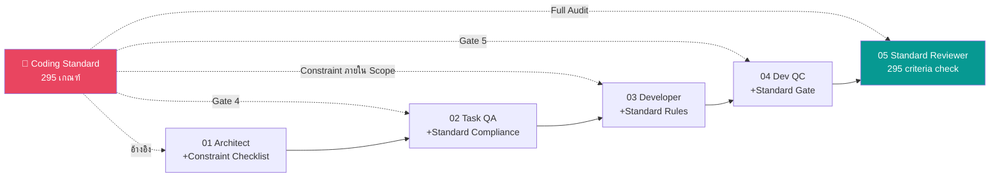

# 🗺️ Role-Plan — แผนปรับปรุง Ai-Role ให้สอดคล้อง Coding Standard 100%

> **วันที่วิเคราะห์:** 12 มีนาคม 2026  
> **วัตถุประสงค์:** วิเคราะห์ Gap ระหว่าง **Ai-Role** (4 บทบาท) กับ **Coding Standard Criteria** (26 หัวข้อ, 295 เกณฑ์)  
> แล้ววางแผนปรับปรุง Role Prompt ให้ AI สามารถปฏิบัติตาม Coding Standard ได้ครบ 100%

---

## สารบัญ

| # | หัวข้อ |
|---|--------|
| 1 | [สรุปสถานะปัจจุบัน — Current State](#1-สรุปสถานะปัจจุบัน--current-state) |
| 2 | [Gap Analysis — ปัญหาที่พบ](#2-gap-analysis--ปัญหาที่พบ) |
| 3 | [แผนปรับปรุงรายละเอียด — Improvement Plan](#3-แผนปรับปรุงรายละเอียด--improvement-plan) |
| 4 | [Role ใหม่ที่ต้องเพิ่ม](#4-role-ใหม่ที่ต้องเพิ่ม) |
| 5 | [Workflow ใหม่ — Ai-Integrated Pipeline](#5-workflow-ใหม่--ai-integrated-pipeline) |
| 6 | [Roadmap & ลำดับความสำคัญ](#6-roadmap--ลำดับความสำคัญ) |
| 7 | [Audit Report — Deep Audit](#7-audit-report--ตรวจสอบความถูกต้อง-role-plan-deep-audit) |
| 8 | [Impact Analysis — ผลกระทบที่ไม่คาดคิด](#8-impact-analysis--ผลกระทบที่ไม่คาดคิด) |

---

## 1. สรุปสถานะปัจจุบัน — Current State

### 1.1 Ai-Role ที่มีอยู่ (4 บทบาท)

| # | Role | ไฟล์ | หน้าที่หลัก | จุดแข็ง |
|---|------|------|------------|---------|
| 01 | **Solution Architect** | `Software Architect Prompt.md` | วิเคราะห์ Solution, ออกเอกสาร Task | TOT + COT + Block-Split-Chunk, 2-Table Validation, Audit State ดี |
| 02 | **Task QA** | `Task QA Prompt.md` | ตรวจสอบเอกสารสั่งงาน | 3-Gate Validation (Alignment, Scope, Over-Engineering) ครบ |
| 03 | **Developer** | `Developer Prompt.md` | Implement ตามเอกสาร | 6 Phase Workflow, Strict Scope Enforcement, Self-Verification |
| 04 | **Developer QC** | `Developer QC Prompt.md` | ตรวจสอบผลงาน Developer | 4-Gate Dynamic Validation, Cross-Document Verification |

### 1.2 Coding Standard ที่ต้องปฏิบัติตาม

| หมวด | Sections | จำนวนเกณฑ์ | ระดับ |
|------|----------|:----------:|:-----:|
| Architecture | §1, §2, §6, §14 | 88 | 🔴 ส่วนใหญ่บังคับ |
| Data & Business | §3, §4, §5 | 54 | 🔴 บังคับทั้งหมด |
| Security | §7, §9, §15, §19 | 30 | 🔴 บังคับทั้งหมด |
| Quality & Testing | §8, §11, §12, §20 | 38 | 🔴/🟡 ผสม |
| API Design | §10, §13, §21 | 21 | 🔴/🟡 ผสม |
| Performance | §16, §17, §18 | 30 | 🔴 บังคับทั้งหมด |
| Advanced Patterns | §22, §23, §24, §25 | 27 | 🟡 แนะนำ |
| DevOps | §26 | 7 | 🔴 บังคับ |
| **รวม** | **26 sections** | **295** | **🔴 246 / 🟡 49** |

---

## 2. Gap Analysis — ปัญหาที่พบ

### 2.1 ❌ Critical Gap — Coding Standard ไม่ถูกฝังในทุก Role

> **ปัญหาหลัก:** ไม่มี Role ใดที่ "รู้" Coding Standard — ทุก Role ทำงานตามเอกสารสั่งงานอย่างเดียว  
> ผลลัพธ์: AI อาจทำงานถูกตามเอกสาร แต่ **ผิด Coding Standard** ได้

| Role | รู้จัก Coding Standard? | ผลกระทบ |
|------|:----------------------:|---------|
| 01 Solution Architect | ❌ ไม่อ้างอิง | ออก Solution ที่อาจ **ขัดกับ Architecture Pattern** (§1, §3, §6) |
| 02 Task QA | ❌ ไม่อ้างอิง | ตรวจเอกสาร pass ทั้งที่สั่งงานอาจ **ผิด Naming Convention** (§2) หรือ **ผิด Pattern** (§3-§5) |
| 03 Developer | ❌ ไม่อ้างอิง | เขียน code ตามเอกสาร แต่อาจ **ผิด Coding Style** (§14), **ขาด CancellationToken** (§3-§5), **ผิด Naming** (§2) |
| 04 Developer QC | ❌ ไม่อ้างอิง | ตรวจ code pass ทั้งที่ **ผิด Coding Standard** เพราะตรวจแค่ "ตามเอกสาร" |

### 2.2 ❌ Missing Role — ไม่มีตัวกรอง Coding Standard โดยเฉพาะ

| สิ่งที่ขาด | ผลกระทบ |
|-----------|---------|
| **Coding Standard Reviewer** | ไม่มีใครตรวจ 295 เกณฑ์อย่างเป็นระบบ — Developer QC ตรวจแค่ "ตรงตามเอกสารสั่งงาน" |
| **Project Scaffold / Init Role** | ไม่มี AI ช่วยสร้าง Project Structure (§1) ให้ถูกตั้งแต่เริ่ม |
| **Test Generator Role** | Developer Prompt สั่ง "เขียน Unit Test" แต่ไม่มี role เฉพาะที่รู้ §12 ทั้งหมด |

### 2.3 ⚠️ Gap ในแต่ละ Role โดยละเอียด

#### Role 01 — Solution Architect

| Gap | รายละเอียด | Coding Standard ที่เกี่ยวข้อง |
|-----|-----------|------------------------------|
| G1.1 | ไม่ระบุ **Project Structure** ที่ถูกต้องใน Solution | §1 Project Structure (10 เกณฑ์) |
| G1.2 | ไม่ระบุ **Data Access Pattern** ที่ต้องใช้ (Dapper + Repository) | §3 DataAccess Layer (38 เกณฑ์) |
| G1.3 | ไม่ระบุ **Service Layer Pattern** (Interface, DI, ResultModel) | §4, §6 Service + DI (14 เกณฑ์) |
| G1.4 | ไม่ระบุ **Security Requirements** (JWT, Input Validation) | §7, §15 Auth + Validation (16 เกณฑ์) |
| G1.5 | ไม่ระบุ **Testing Strategy** ใน Solution | §12 Testing (15 เกณฑ์) |
| G1.6 | ไม่ระบุ **Performance Considerations** | §17 Performance (10 เกณฑ์) |
| G1.7 | ไม่ระบุ **DevOps Constraints** (ห้ามแก้ Jenkinsfile/Dockerfile) | §26 DevOps (7 เกณฑ์) |
| G1.8 | ไม่มี **Checklist เทียบ Coding Standard** ก่อน Approve Solution | ทุก Section |

#### Role 02 — Task QA

| Gap | รายละเอียด | Coding Standard ที่เกี่ยวข้อง |
|-----|-----------|------------------------------|
| G2.1 | Gate 1 (Alignment) ไม่เทียบกับ **Coding Standard** เป็น baseline | ทั้ง 26 sections |
| G2.2 | Gate 2 (Scope) ไม่ตรวจว่าเอกสารสั่ง **Naming Convention** ถูกหรือไม่ | §2 Naming (62 เกณฑ์) |
| G2.3 | Gate 3 (Over-Engineering) ไม่มี reference ว่าอะไรคือ **standard pattern** ขององค์กร | §3-§6 Layer patterns |
| G2.4 | ไม่มี **Gate 4: Coding Standard Compliance** — ตรวจว่าเอกสารสั่งงานไม่ขัดกับ standard | เพิ่ม Gate ใหม่ |

#### Role 03 — Developer

| Gap | รายละเอียด | Coding Standard ที่เกี่ยวข้อง |
|-----|-----------|------------------------------|
| G3.1 | **Phase 2** (Pre-Implementation) ไม่มีการเช็ค Coding Standard ก่อนเขียน | ทุก Section |
| G3.2 | **Phase 3** (Implementation) สั่งให้ "Follow Existing Patterns" แต่ไม่ระบุว่า pattern มาตรฐานคืออะไร | §1-§6, §14 |
| G3.3 | ไม่มีข้อกำหนดเรื่อง **Naming Convention** | §2 (62 เกณฑ์) |
| G3.4 | ไม่มีข้อกำหนดเรื่อง **async/CancellationToken** chain | §3.12-3.15, §4.4, §5.8 |
| G3.5 | ไม่มีข้อกำหนดเรื่อง **Security** (SQL Injection, Secret Management) | §3.6, §3.21-§3.26, §7, §15 |
| G3.6 | ไม่มีข้อกำหนดเรื่อง **Code Complexity** | §20 Complexity (6 เกณฑ์) |
| G3.7 | ไม่มีข้อกำหนดเรื่อง **Error Handling Pattern** (try-catch + ResultModel) | §4.6, §8 |
| G3.8 | **Phase 5** (Unit Test) ไม่มีรายละเอียดเรื่อง Testing Standard | §12 (15 เกณฑ์) |
| G3.9 | ไม่ระบุเรื่อง **DevOps Files** ที่ห้ามแก้ | §26 (7 เกณฑ์) |
| G3.10 | ไม่มีข้อกำหนดเรื่อง **Code Formatting** (.editorconfig, Allman Style) | §14 (10 เกณฑ์) |

#### Role 04 — Developer QC

| Gap | รายละเอียด | Coding Standard ที่เกี่ยวข้อง |
|-----|-----------|------------------------------|
| G4.1 | **Gate 2** (Code Verification) ไม่มี Coding Standard เป็น baseline ตรวจ | ทุก Section |
| G4.2 | ไม่ตรวจ **Naming Convention** | §2 (62 เกณฑ์) |
| G4.3 | ไม่ตรวจ **Code Formatting** | §14 (10 เกณฑ์) |
| G4.4 | ไม่ตรวจ **Security Compliance** (SQL Injection, Secret leak) | §3.6, §3.21, §7, §15, §16.4 |
| G4.5 | ไม่ตรวจ **Performance Anti-patterns** (N+1, .Result, sync-over-async) | §17 (10 เกณฑ์) |
| G4.6 | ไม่ตรวจ **Code Complexity** | §20 (6 เกณฑ์) |
| G4.7 | ไม่ตรวจ **Unit Test Quality** (coverage, AAA, naming) | §12 (15 เกณฑ์) |
| G4.8 | ไม่มี **Gate 5: Coding Standard Gate** | เพิ่ม Gate ใหม่ |

### 2.4 สรุป Gap Score

| Role | Gap จำนวน | ระดับความรุนแรง | Coding Standard Coverage |
|------|:---------:|:--------------:|:-----------------------:|
| 01 Solution Architect | 8 | 🔴 Critical | ~5% (รู้แค่หลักการทั่วไป) |
| 02 Task QA | 4 | 🔴 Critical | ~10% (ตรวจ scope แต่ไม่ตรวจ standard) |
| 03 Developer | 10 | 🔴 Critical | ~15% (follow existing pattern แต่ไม่รู้ standard) |
| 04 Developer QC | 8 | 🔴 Critical | ~10% (ตรวจตามเอกสาร ไม่ตรวจตาม standard) |
| **Overall** | **30 Gaps** | **🔴 Critical** | **~10% Coverage** |

---

## 3. แผนปรับปรุงรายละเอียด — Improvement Plan

### 3.1 หลักการปรับปรุง

> **Strategy:** ฝัง Coding Standard เข้าไปในทุก Role ผ่าน 3 แนวทาง:
> 1. **Reference Injection** — ให้ทุก Role อ้างอิง `Coding_Standard_Criteria.md` เป็น Knowledge Base
> 2. **Checkpoint Addition** — เพิ่ม Coding Standard Checkpoint ในทุก Phase/Gate ที่เกี่ยวข้อง
> 3. **New Role Creation** — สร้าง Role ใหม่สำหรับงานที่ไม่มี Role รับผิดชอบ

### 3.2 ปรับปรุง Role 01 — Solution Architect

#### สิ่งที่ต้องเพิ่มใน Prompt

| # | สิ่งที่เพิ่ม | รายละเอียด | Section อ้างอิง |
|---|------------|-----------|:---------------:|
| A1 | **Knowledge Base Reference** | เพิ่ม directive: "ต้องอ่าน `Coding_Standard_Criteria.md` ก่อนเริ่มวิเคราะห์" | ทั้งหมด |
| A2 | **Architecture Constraint** | Solution ต้องระบุ Project Structure ตาม §1 (3-Layer, folders) | §1 |
| A3 | **Data Access Constraint** | ถ้าเกี่ยวกับ DB — ต้องระบุว่าใช้ Dapper + Repository Pattern | §3 |
| A4 | **Security Checklist** | Solution Table ต้องมี column "Security Consideration" | §7, §9, §15 |
| A5 | **Testing Strategy** | Solution ต้องระบุ Testing Approach (Unit + Integration) | §12 |
| A6 | **DevOps Awareness** | Audit State ต้องตรวจว่า Solution ไม่แตะ DevOps files | §26 |
| A7 | **Coding Standard Audit Gate** | เพิ่มใน Audit State: "Solution สอดคล้องกับ Coding Standard §1-§26 หรือไม่" | ทั้งหมด |
| A8 | **Task Template Update** | Task ที่ออกมาต้องมี section "Coding Standard Requirements" ระบุเกณฑ์ที่เกี่ยวข้อง | ทั้งหมด |

#### ตัวอย่างสิ่งที่ต้องเพิ่มใน Solution Table

```
| Block | Task | Method | Dependencies | Coding Standard |
|-------|------|--------|--------------|-----------------|
| 1 | สร้าง Repository | Dapper + BaseRepository | IDbConnectionFactory | §3.1-3.5, §3.12-3.15 |
| 2 | สร้าง Service | Interface + DI | IRepository | §4.1-4.8, §6.3-6.4 |
| 3 | เพิ่ม Endpoint | ControllerBase + Authorize | IService | §5.1-5.8, §7.6 |
```

### 3.3 ปรับปรุง Role 02 — Task QA

#### สิ่งที่ต้องเพิ่มใน Prompt

| # | สิ่งที่เพิ่ม | รายละเอียด |
|---|------------|-----------|
| B1 | **Knowledge Base Reference** | อ่าน `Coding_Standard_Criteria.md` ก่อนตรวจ |
| B2 | **Gate 4: Coding Standard Compliance** (ใหม่) | ตรวจว่าเอกสารสั่งงานไม่ขัดกับ Coding Standard 295 เกณฑ์ (รวม Naming §2 ไว้ที่นี่) |
| B3 | **Pattern Validation** | Gate 1 เพิ่มตรวจ: แนวทางที่สั่งสอดคล้องกับ Standard Pattern (§3-§6) หรือไม่ |

#### Gate 4 ใหม่ที่ต้องเพิ่ม

```markdown
### 🚪 GATE 4: Coding Standard Compliance — เอกสารสอดคล้องกับ Coding Standard หรือไม่

ตรวจสอบว่าเอกสารสั่งงานไม่ขัดกับ Coding Standard Criteria

1. **Naming Convention** — ชื่อ Class/Method/Variable ที่ระบุในเอกสารถูกต้องตาม §2?
2. **Architecture Pattern** — แนวทางที่สั่งสอดคล้องกับ §1 (Structure), §3 (Dapper), §4 (Service), §5 (Controller)?
3. **Security** — เอกสารระบุ Security Consideration ตาม §7, §9, §15?
4. **Testing** — เอกสารระบุ Testing Requirement ตาม §12?
5. **DevOps Constraint** — เอกสารระบุว่าห้ามแก้ DevOps files ตาม §26?
```

### 3.4 ปรับปรุง Role 03 — Developer

#### สิ่งที่ต้องเพิ่มใน Prompt

| # | สิ่งที่เพิ่ม | Phase | รายละเอียด |
|---|------------|:-----:|-----------|
| C1 | **Knowledge Base** | ก่อนเริ่ม | "ต้องอ่าน `Coding_Standard_Criteria.md` และปฏิบัติตามเสมอ" |
| C2 | **Naming Convention Rules** | Phase 3 | เพิ่ม directive: ตั้งชื่อตาม §2 ทั้งหมด (PascalCase, _camelCase, etc.) |
| C3 | **Async/CT Chain** | Phase 3 | เพิ่ม directive: ทุก method ที่มี I/O ต้อง async + CancellationToken ตาม §3.12-3.15, §4.4, §5.8 |
| C4 | **Security Rules** | Phase 3 | เพิ่ม directive: ห้าม string interpolation SQL (§3.6), ใช้ @parameter เสมอ |
| C5 | **Error Handling Pattern** | Phase 3 | เพิ่ม directive: try-catch + ILogger + ResultModel ตาม §4.6, §8 |
| C6 | **Code Formatting** | Phase 3 | เพิ่ม directive: Allman Style, 4 spaces, braces เสมอ ตาม §14 |
| C7 | **Complexity Check** | Phase 4 | Self-Verification เพิ่มตรวจ: Cognitive ≤15, Cyclomatic ≤10, Method ≤30 lines ตาม §20 |
| C8 | **Testing Standards** | Phase 5 | เพิ่มรายละเอียด: xUnit, AAA Pattern, Naming: `{Method}_{Scenario}_{Expected}` ตาม §12 |
| C9 | **DevOps Guard** | Phase 3 | เพิ่ม directive: "ห้ามแก้ไข Jenkinsfile, Dockerfile, deployment.yaml" ตาม §26 |
| C10 | **Code Quality Check** | Phase 4 | เพิ่มตรวจ: ไม่มี unused using, ไม่มี commented-out code, ไม่มี magic number ตาม §11 |
| C11 | **Reference Project** | Phase 2 | เพิ่ม directive: "ดู `ESTATEMENT_API/` เป็นตัวอย่าง Structure (ไม่ใช่ DataAccess pattern เพราะใช้ EF Core)" |

#### Priority Chain ที่ต้องปรับ

> ⚠️ **หลักการสำคัญ:** Coding Standard เป็น **constraint** (บังคับปฏิบัติภายใน scope) ไม่ใช่ **override** (สูงกว่าเอกสารสั่งงาน)  
> Developer ต้องทำตาม Standard เสมอ **ภายในขอบเขตที่เอกสารกำหนด** — ถ้าขัดแย้งจริง → หยุดถาม ไม่ตัดสินใจเอง

```
เมื่อกฎขัดแย้งกัน ให้ยึดลำดับความสำคัญนี้:
1. เอกสารสั่งงาน (Development Task) — สูงสุด (scope control)
2. Coding Standard Criteria — บังคับปฏิบัติภายใน scope ของเอกสาร ★ ใหม่
3. Out of Scope / ข้อห้ามในเอกสาร
4. กฎเหล็กของ Prompt นี้
5. สถานการณ์พิเศษ (Edge Cases)

⚠️ ถ้าปฏิบัติตามเอกสารสั่งงานแล้วจะทำให้ผิด Coding Standard → หยุดและรายงาน
   (ไม่ตัดสินใจเอง — ไม่ Refactor เอง — ไม่เพิ่มงานนอก scope)
```

### 3.5 ปรับปรุง Role 04 — Developer QC

#### สิ่งที่ต้องเพิ่มใน Prompt

| # | สิ่งที่เพิ่ม | รายละเอียด |
|---|------------|-----------|
| D1 | **Knowledge Base** | "ต้องอ่าน `Coding_Standard_Criteria.md` เป็น baseline ตรวจ" |
| D2 | **Gate 5: Coding Standard Gate** (ใหม่) | ตรวจ code จริงเทียบกับ 295 เกณฑ์ |
| D3 | **Naming Audit** | Gate 2 เพิ่ม: ตรวจชื่อ Class/Method/Variable ตาม §2 |
| D4 | **Security Scan** | Gate 2 เพิ่ม: ตรวจ SQL Injection (§3.6), Secret leak (§3.21), PII log (§16.4) |
| D5 | **Performance Check** | Gate 2 เพิ่ม: ตรวจ N+1 Query (§17.2), .Result/.Wait() (§17.6), async chain |
| D6 | **Complexity Check** | Gate 5: ตรวจ Cognitive/Cyclomatic complexity ตาม §20 |
| D7 | **Test Quality Check** | Gate 4 เพิ่ม: ตรวจ Test naming, AAA pattern, coverage ตาม §12 |
| D8 | **Code Quality Scan** | Gate 5: unused using, commented-out code, magic number ตาม §11 |

#### Gate 5 ใหม่ที่ต้องเพิ่ม

```markdown
### 🚪 GATE 5: Coding Standard Compliance — Code ผ่าน Coding Standard หรือไม่

ตรวจ code จริงเทียบกับ Coding Standard Criteria ที่เกี่ยวข้อง

**5A. Architecture & Structure (§1, §6)**
- [ ] Project Structure ถูกต้อง (3-Layer, Interfaces folder)
- [ ] DI Registration ถูกต้อง (Lifetime: Singleton/Scoped)

**5B. Naming Convention (§2)**
- [ ] Class/Interface/Method ใช้ PascalCase
- [ ] Private field ใช้ _camelCase
- [ ] Method ขึ้นต้นด้วย Verb, Boolean ขึ้นต้นด้วย Is/Has/Can
- [ ] ไม่มี Hungarian Notation, UPPER_SNAKE_CASE, ตัวย่อไม่สากล

**5C. DataAccess Pattern (§3)**
- [ ] ใช้ Dapper + Repository Pattern
- [ ] SQL ใช้ @parameter (ไม่มี string interpolation)
- [ ] async + CancellationToken ครบ
- [ ] using ปิด Connection

**5D. Service & Controller Pattern (§4, §5)**
- [ ] Service มี Interface, Constructor Injection
- [ ] Controller บาง (receive-call-respond)
- [ ] Return DTO ไม่ Return Entity

**5E. Security (§7, §9, §15)**
- [ ] JWT Configuration ถูกต้อง
- [ ] ไม่มี Hard-coded secret
- [ ] Input Validation (FluentValidation/DataAnnotations)

**5F. Code Quality (§11, §14, §20)**
- [ ] ไม่มี unused using, commented-out code
- [ ] Code formatting: Allman, 4 spaces, braces
- [ ] Complexity: Cognitive ≤15, Cyclomatic ≤10
- [ ] Method ≤30 lines, Parameters ≤4

**5G. Testing (§12)**
- [ ] Unit Test มี (ถ้าเข้าเงื่อนไข)
- [ ] xUnit + Moq, AAA Pattern
- [ ] Test Naming: {Method}_{Scenario}_{Expected}

**5H. Performance (§17)**
- [ ] ไม่มี N+1 Query
- [ ] ไม่มี .Result/.Wait() (sync-over-async)
- [ ] Async ตลอด pipeline
```

---

## 4. Role ใหม่ที่ต้องเพิ่ม

### 4.1 Role 05 — Coding Standard Reviewer (ใหม่)

> **วัตถุประสงค์:** Role เฉพาะสำหรับตรวจ Coding Standard 295 เกณฑ์อย่างเป็นระบบ  
> **ใช้เมื่อไหร่:** หลัง Developer QC Approve — เป็นด่านสุดท้ายก่อน merge  
> **แตกต่างจาก Developer QC:** Developer QC ตรวจ "ตรงตามเอกสาร" — Role นี้ตรวจ "ตรงตาม Standard"

| หัวข้อ | รายละเอียด |
|--------|-----------|
| **Input** | Codebase จริง + `Coding_Standard_Criteria.md` |
| **Output** | Coding Standard Report (PASS/FAIL พร้อมเกณฑ์ที่ไม่ผ่าน) |
| **Method** | Automated Checklist (295 เกณฑ์) + CoT Verification |
| **ขอบเขต** | ตรวจเฉพาะ Coding Standard — ไม่ตรวจ business logic |

#### Workflow

```
1. อ่าน Coding_Standard_Criteria.md
2. สแกน Codebase → สกัดรายการที่ต้องตรวจ
3. ตรวจทีละ Section (§1-§26)
4. สร้าง Report: PASS/FAIL พร้อมเกณฑ์ที่ไม่ผ่าน + วิธีแก้
5. ถ้ามี FAIL → ส่งกลับ Developer แก้ไข
```

### 4.2 Role 00 — Project Initializer (ใหม่)

> **วัตถุประสงค์:** สร้าง Project Structure ให้ถูกตั้งแต่เริ่มต้น ตาม §1  
> **ใช้เมื่อไหร่:** เมื่อเริ่มโปรเจคใหม่  

| หัวข้อ | รายละเอียด |
|--------|-----------|
| **Input** | ชื่อโปรเจค + Feature Requirements |
| **Output** | Solution structure ครบ (§1) + Boilerplate code (§3-§6) + .editorconfig (§14) + Test project (§12) |
| **Method** | Template Generation + §1 Compliance Check |

#### สิ่งที่สร้าง

```
{SolutionName}/
├── .editorconfig                     ← §14
├── {SolutionName}.sln
├── src/
│   └── {ProjectName}/
│       ├── Controllers/
│       │   └── HealthCheckController.cs   ← §5.6
│       ├── Services/
│       │   └── Interfaces/                ← §1.3
│       ├── DataAccess/
│       │   ├── Connections/               ← §1.4
│       │   │   ├── IDbConnectionFactory.cs ← §3.3
│       │   │   └── DbConnectionFactory.cs
│       │   ├── Repositories/
│       │   │   ├── Interfaces/            ← §1.5
│       │   │   │   └── IBaseRepository.cs ← §3.4
│       │   │   └── BaseRepository.cs
│       │   └── SqlQueries/                ← §1.9
│       ├── Models/
│       │   ├── Entities/                  ← §1.2
│       │   ├── Requests/                  ← §1.2
│       │   └── ResultModel.cs             ← §4.7, §8.5
│       ├── Filters/
│       │   └── LogFilter.cs               ← §1.6, §8.7
│       ├── Middleware/                     ← §1.10
│       │   └── CorrelationIdMiddleware.cs  ← §16.2
│       ├── Program.cs                     ← §6
│       ├── appsettings.json               ← §9.1
│       ├── appsettings.Development.json   ← §9.2
│       ├── appsettings.UAT.json           ← §9.2
│       └── appsettings.Production.json    ← §9.2
└── tests/
    ├── {ProjectName}.Tests/               ← §12.5
    └── {ProjectName}.IntegrationTests/    ← §12.5
```

> ✅ **หมายเหตุ:** มี `CodingStandard/Template/src/SampleAPI/` อยู่แล้ว — Role 00 ควรใช้ Template นี้เป็นฐาน ไม่ต้องสร้างจากศูนย์  
> ⚠️ **ข้อควรระวัง:** `ESTATEMENT_API/` ใช้ EF Core + UnitOfWork ไม่ใช่ Dapper — อ้างอิงได้เฉพาะ **Structure** เท่านั้น (ดู `Research/Dapper_Migration_Analysis.md`)

### 4.3 หมายเหตุ: Test Generator Role

> *Test Generator ไม่แยกเป็น Role ต่างหาก เพราะ Developer Prompt Phase 5 จะถูกปรับปรุงให้ครอบคลุม §12 ทั้งหมดแล้ว (xUnit, AAA, Naming, Coverage)  
> ถ้าอนาคต Phase 5 ยังไม่เพียงพอ ค่อยแยก Role*

| # | Role | สถานะ | หน้าที่ |
|---|------|:------:|--------|
| 00 | **Project Initializer** | 🆕 ใหม่ | สร้าง Project Structure + Boilerplate ตาม Standard |
| 01 | Solution Architect | 🔧 ปรับปรุง | วิเคราะห์ Solution + **เทียบ Coding Standard** |
| 02 | Task QA | 🔧 ปรับปรุง | ตรวจเอกสาร + **Gate 4: Standard Compliance** |
| 03 | Developer | 🔧 ปรับปรุง | Implement + **ปฏิบัติตาม Coding Standard** |
| 04 | Developer QC | 🔧 ปรับปรุง | ตรวจผลงาน + **Gate 5: Standard Gate** |
| 05 | **Coding Standard Reviewer** | 🆕 ใหม่ | ตรวจ 295 เกณฑ์อย่างเป็นระบบ |

---

## 5. Workflow ใหม่ — Ai-Integrated Pipeline

### 5.1 Workflow เดิม

```
Requirement → [01 Architect] → [02 Task QA] → [03 Developer] → [04 Dev QC] → Done
                 ↑ Reject         ↑ Reject        ↑ Reject        ↑ Reject
```

**ปัญหา:** ไม่มีจุดไหนตรวจ Coding Standard → Code อาจผ่านทุก Gate แต่ผิด Standard

### 5.2 Workflow ใหม่ (Proposed)

```
New Project?
    ├─ YES → [00 Project Init] → สร้าง Structure ตาม §1
    └─ NO  → ข้าม

Requirement
    │
    ▼
[01 Solution Architect] ── อ้างอิง Coding Standard ──→ Solution + Task
    │ ↑ Reject (ขัด Standard)
    ▼
[02 Task QA] ── Gate 4: Standard Compliance ──→ Approved Task
    │ ↑ Reject
    ▼
[03 Developer] ── ปฏิบัติตาม Coding Standard (ภายใน scope) ──→ Code + Report
    │ ↑ Reject
    ▼
[04 Developer QC] ── Gate 5: Standard Gate ──→ QC Approved
    │
    ▼
ขนาดงาน?
    ├─ New Project / New Feature  → [05 Coding Standard Reviewer] ── Full Audit ──→ ✅ MERGE READY
    ├─ Modify Existing (>10 lines) → [05] ── Partial Audit (เฉพาะ section) ──→ ✅ MERGE READY
    └─ Hotfix / 1-line change      → ✅ MERGE READY (Dev QC Gate 5 เพียงพอ)
        ↑ Reject (ส่งกลับ Developer)
```

### 5.3 Coding Standard Integration Points



---

## 6. Roadmap & ลำดับความสำคัญ

### 6.1 Phase 1 — Quick Wins (สัปดาห์ที่ 1-2) 🔴 ทำทันที

| # | Task | Impact | Effort |
|---|------|:------:|:------:|
| P1.1 | เพิ่ม **Knowledge Base Reference** ในทุก Role Prompt — "ต้องอ่าน Coding_Standard_Criteria.md" | สูง | ต่ำ |
| P1.2 | ปรับ **Developer Prompt** — เพิ่ม Naming Convention (§2), async/CT (§3-§5), Security (§3.6) rules | สูง | กลาง |
| P1.3 | ปรับ **Developer QC Prompt** — เพิ่ม Naming Audit, Security Scan ใน Gate 2 | สูง | กลาง |
| P1.4 | ปรับ **Priority Chain** ของ Developer — Coding Standard เป็น **constraint ภายใน scope** (ไม่ใช่ override เอกสารสั่งงาน) | สูง | ต่ำ |

### 6.2 Phase 2 — Core Improvements (สัปดาห์ที่ 3-4)

| # | Task | Impact | Effort |
|---|------|:------:|:------:|
| P2.1 | ปรับ **Solution Architect Prompt** — เพิ่ม Architecture Constraint, Task Template Update | สูง | กลาง |
| P2.2 | เพิ่ม **Gate 4** ใน Task QA Prompt | สูง | กลาง |
| P2.3 | เพิ่ม **Gate 5** ใน Developer QC Prompt | สูง | กลาง |
| P2.4 | ปรับ **Developer Prompt** Phase 3 เพิ่ม Code Formatting (§14), Error Handling Pattern (§8) | กลาง | กลาง |
| P2.5 | ปรับ **Developer Prompt** Phase 5 เพิ่ม Testing Standard รายละเอียด (§12) | กลาง | กลาง |

### 6.3 Phase 3 — New Roles (สัปดาห์ที่ 5-6)

| # | Task | Impact | Effort |
|---|------|:------:|:------:|
| P3.1 | สร้าง **Role 05 — Coding Standard Reviewer** Prompt | สูง | สูง |
| P3.2 | สร้าง **Role 00 — Project Initializer** Prompt | กลาง | สูง |
| P3.3 | สร้าง **Template Code** สำหรับ Role 00 (BaseRepository, ResultModel, etc.) | กลาง | กลาง |

### 6.4 Phase 4 — Optimization (สัปดาห์ที่ 7-8)

| # | Task | Impact | Effort |
|---|------|:------:|:------:|
| P4.1 | ทดสอบ Workflow ใหม่กับโปรเจคจริง | สูง | สูง |
| P4.2 | สร้าง **Coding Standard Cheat Sheet** (ย่อจาก 295 เกณฑ์) สำหรับแนบทุก Role | กลาง | กลาง |
| P4.3 | ปรับปรุง Prompt ตาม Feedback จากการทดสอบ | สูง | กลาง |
| P4.4 | ปรับปรุง `CodingStandard/_check.py` ให้ครอบคลุม 295 เกณฑ์ + AI เรียกใช้ได้ | กลาง | สูง |

### 6.5 Expected Outcome

| Metric | Before | After Phase 1-2 | After Phase 3-4 |
|--------|:------:|:---------------:|:---------------:|
| Coding Standard Coverage ใน AI Roles | ~10% | ~60% | **~95%** |
| Gap ที่เหลือ | 30 | ~12 | **~3** (edge cases) |
| Confidence Level | ❌ Low | ⚠️ Medium | ✅ **High** |
| จำนวน Role | 4 | 4 (ปรับปรุง) | **6** (เพิ่ม 2) |

> *Coverage estimate methodology: นับจำนวน Coding Standard sections ที่ Role มี directive ครอบคลุม ÷ 26 sections ทั้งหมด*  
> *เช่น Developer ปัจจุบัน: "Follow Existing Patterns" ≈ §14 + "Unit Test" ≈ §12 บางส่วน + "YAGNI" ≈ §20 ทางอ้อม ≈ 3-4/26 ≈ ~12-15%*

### 6.6 Definition of Done — เกณฑ์วัดว่าแต่ละ Phase เสร็จ

| Phase | Definition of Done |
|:-----:|-------------------|
| **Phase 1** | ✅ ทุก Role Prompt มี Knowledge Base Reference + Developer Prompt มี §2 Naming, §3 async/CT, §3.6 Security rules + Dev QC มี Naming/Security ใน Gate 2 + Priority Chain แก้แล้ว |
| **Phase 2** | ✅ Architect มี Architecture Constraint + Task Output มี "Coding Standard Requirements" section + Task QA มี Gate 4 + Dev QC มี Gate 5 + Developer Phase 3 มี §14/§8 + Phase 5 มี §12 |
| **Phase 3** | ✅ Role 05 Prompt เสร็จ + มีเงื่อนไขเรียกใช้ + Role 00 Prompt เสร็จ + ใช้ Template/ เป็นฐาน + Template Code สร้างครบ |
| **Phase 4** | ✅ ทดสอบกับโปรเจคจริง ≥1 โปรเจค + Cheat Sheet สร้างเสร็จ + `_check.py` ปรับปรุงครบ + Feedback loop ≥1 รอบ |

### 6.7 Risk Assessment — ความเสี่ยงที่ต้องระวัง

| # | Risk | ผลกระทบ | Likelihood | Mitigation |
|---|------|---------|:----------:|-----------|
| R1 | **Context Window เกิน** — Coding Standard 2,925 บรรทัด ฝังทุก Prompt ไม่ได้ | AI จำ Standard ไม่ครบ → ตรวจหลุด | สูง | ใช้ **Tiered Reference** (ดู §6.8) |
| R2 | **Prompt ยาวเกินไป** — เพิ่ม directive หลายข้อ → AI สับสน | AI ทำตาม directive ไม่ครบ | กลาง | จัดกลุ่ม directive เป็น section ชัดเจน + ใช้ Cheat Sheet ย่อ |
| R3 | **Scope Creep** — Developer ใช้ Standard เป็นข้ออ้าง Refactor เกิน | ทำลาย Scope Control | กลาง | Priority Chain: Standard = constraint ไม่ใช่ override (แก้แล้ว C1) |
| R4 | **Backward Compatibility** — Role Prompt เดิมทำงานอยู่ → ปรับแล้วอาจเสีย | Pipeline หยุดทำงาน | ต่ำ | ทดสอบ Prompt ใหม่กับ Task ตัวอย่าง (AMB123) ก่อน deploy |
| R5 | **ESTATEMENT_API ใช้ EF Core ไม่ใช่ Dapper** — ถ้าอ้างอิงเป็น example อาจสับสน | Developer เขียน EF Core แทน Dapper | กลาง | ระบุชัดว่า "อ้างอิง Structure เท่านั้น ไม่ใช่ DataAccess pattern" |

### 6.8 Context Window Strategy — Tiered Reference

> **ปัญหา:** Coding Standard 2,925 บรรทัด ฝังทั้งหมดใน Prompt ของทุก Role ไม่ได้

| Tier | วิธีการ | ใช้กับ Role | ขนาด |
|:----:|---------|-----------|:----:|
| **Tier 1** | **Cheat Sheet** ย่อ ~50 บรรทัด — เกณฑ์ที่ผิดบ่อยที่สุด (§2 Naming top-10, §3.6 SQL Injection, §14 Allman, §20 Complexity) | ฝังใน Prompt ทุก Role | ~50 lines |
| **Tier 2** | **Section-specific** — ระบุใน Task ว่า sections ไหนเกี่ยวข้อง (เช่น "Task นี้เกี่ยวกับ §3, §4, §12") → AI อ่านเฉพาะ section | Developer, Dev QC | ตาม Task |
| **Tier 3** | **Full Reference** — สั่งให้ AI "อ่าน `Coding_Standard_Criteria.md` ทั้งไฟล์" เมื่อต้อง full audit | Role 05, Role 00 | 2,925 lines |

---

## ภาคผนวก: Coding Standard Sections → Role Mapping

| Section | เกณฑ์ | Architect | Task QA | Developer | Dev QC | Std Reviewer |
|:-------:|:-----:|:---------:|:-------:|:---------:|:------:|:------------:|
| §1 Structure | 10 | ✅ ออกแบบ | ✅ ตรวจ | ✅ ปฏิบัติ | ✅ ตรวจ | ✅ Audit |
| §2 Naming | 62 | ✅ ตั้งชื่อใน Task | ✅ ตรวจชื่อ | ✅ ปฏิบัติ | ✅ ตรวจ | ✅ Audit |
| §3 DataAccess | 38 | ✅ ออกแบบ | ✅ ตรวจ | ✅ ปฏิบัติ | ✅ ตรวจ | ✅ Audit |
| §4 Service | 8 | ✅ ออกแบบ | ✅ ตรวจ | ✅ ปฏิบัติ | ✅ ตรวจ | ✅ Audit |
| §5 Controller | 8 | ✅ ออกแบบ | ✅ ตรวจ | ✅ ปฏิบัติ | ✅ ตรวจ | ✅ Audit |
| §6 DI | 6 | ✅ ออกแบบ | — | ✅ ปฏิบัติ | ✅ ตรวจ | ✅ Audit |
| §7 Auth | 6 | ✅ ระบุ | ✅ ตรวจ | ✅ ปฏิบัติ | ✅ ตรวจ | ✅ Audit |
| §8 Error | 7 | ✅ ระบุ pattern | — | ✅ ปฏิบัติ | ✅ ตรวจ | ✅ Audit |
| §9 Config | 6 | ✅ ระบุ | — | ✅ ปฏิบัติ | ✅ ตรวจ | ✅ Audit |
| §10 OpenAPI | 5 | — | — | ✅ ปฏิบัติ | ✅ ตรวจ XML Comment | ✅ Audit |
| §11 Quality | 10 | — | — | ✅ ปฏิบัติ | ✅ ตรวจ | ✅ Audit |
| §12 Testing | 15 | ✅ ระบุ strategy | ✅ ตรวจ | ✅ ปฏิบัติ | ✅ ตรวจ | ✅ Audit |
| §13 API Design | 12 | ✅ ออกแบบ | ✅ ตรวจ | ✅ ปฏิบัติ | ✅ ตรวจ | ✅ Audit |
| §14 Formatting | 10 | — | — | ✅ ปฏิบัติ | ✅ ตรวจ | ✅ Audit |
| §15 Validation | 10 | ✅ ระบุ | ✅ ตรวจ | ✅ ปฏิบัติ | ✅ ตรวจ | ✅ Audit |
| §16 Observability | 10 | ✅ ระบุ | — | ✅ ปฏิบัติ | ✅ ตรวจ | ✅ Audit |
| §17 Performance | 10 | ✅ ระบุ SLA | — | ✅ ปฏิบัติ | ✅ ตรวจ | ✅ Audit |
| §18 HTTP Client | 10 | ✅ ระบุ | — | ✅ ปฏิบัติ | ✅ ตรวจ | ✅ Audit |
| §19 Dependency | 8 | ✅ ระบุ | — | ✅ ปฏิบัติ | ✅ ตรวจ package | ✅ Audit |
| §20 Complexity | 6 | — | — | ✅ Self-check | ✅ ตรวจ | ✅ Audit |
| §21 Documentation | 4 | — | — | ✅ ปฏิบัติ | ✅ ตรวจ XML Comment | ✅ Audit |
| §22 Resilience | 8 | ✅ ออกแบบ | — | ✅ ปฏิบัติ | ✅ ตรวจ | ✅ Audit |
| §23 Concurrency | 6 | ✅ ระบุ | — | ✅ ปฏิบัติ | ✅ ตรวจ | ✅ Audit |
| §24 Caching | 8 | ✅ ออกแบบ | — | ✅ ปฏิบัติ | ✅ ตรวจ | ✅ Audit |
| §25 Feature Flags | 5 | ✅ ระบุ | — | ✅ ปฏิบัติ | — | ✅ Audit |
| §26 DevOps | 7 | ✅ ระบุ | ✅ ตรวจ | ✅ ปฏิบัติ | ✅ ตรวจ | ✅ Audit |

---

> **สร้างเมื่อ:** 12 มีนาคม 2026  
> **ผู้วิเคราะห์:** AI Analysis — based on Ai-Role folder + Coding_Standard_Criteria.md  
> **สถานะ:** Draft — ผ่าน Deep Audit + Impact Analysis แล้ว (ดู §7, §8) — รอ Approve ก่อนดำเนินการ Phase 1

---

## 8. Impact Analysis — ผลกระทบที่ไม่คาดคิด

> 📅 **วิเคราะห์เมื่อ:** 12 มีนาคม 2026  
> 🎯 **วัตถุประสงค์:** ระบุ **ผลกระทบทางอ้อม (unintended consequences)** ที่การปรับปรุง Role-Plan อาจก่อให้เกิด — แม้ว่า "สิ่งที่ทำ" จะถูกต้องตาม Audit แต่ "ผลที่เกิด" อาจไม่ตรงที่คาด
>
> **Baseline ก่อนเปลี่ยน:**
>
> | Role | ขนาด Prompt | ลักษณะ |
> |------|:----------:|--------|
> | 01 Architect | 119 lines / ~9K chars | กระชับ, TOT+COT loop, ไม่มี standard |
> | 02 Task QA | 117 lines / ~12K chars | 3-Gate, ตรวจ scope/alignment |
> | 03 Developer | 199 lines / ~17K chars | 6-Phase, strict scope, 7 ข้อห้าม |
> | 04 Dev QC | 208 lines / ~17K chars | 4-Gate dynamic, CoT ทุก Gate |
> | Coding Standard | 2,925 lines | 295 เกณฑ์, 26 sections |

---

### 8.1 🔴 Impact ระดับ Critical — อาจทำลายสิ่งที่ทำงานดีอยู่แล้ว

#### I-C1: Prompt Bloat → AI Instruction Following ลดลง

**สิ่งที่ทำ:** เพิ่ม C1-C11 (11 directives) ใน Developer Prompt + Priority Chain ใหม่  
**ขนาดที่เพิ่ม:** ประมาณ 60-80 lines → Prompt จะยาว ~260-280 lines (~22K chars)

**ผลกระทบที่ไม่คาดคิด:**
- 🔴 **AI instruction following จะลดลง** — งานวิจัย (Anthropic, OpenAI) แสดงว่า Prompt ที่ยาวกว่า ~200 lines → AI เริ่ม "ลืม" directives ตอนท้าย
- Developer Prompt ปัจจุบัน (199 lines) อยู่ใกล้ขีดจำกัดแล้ว — เพิ่มอีก 60-80 lines **จะข้ามขีดจำกัด**
- Directives เดิม 7 ข้อห้ามที่ **ทำงานดีอยู่แล้ว** (Minimal Change, YAGNI, Follow Existing Patterns) อาจ **ถูกเบียดบัง** โดย directives ใหม่

**สถานการณ์ตัวอย่าง:**
> Developer Prompt มี 7 ข้อห้ามเดิม + 11 directives ใหม่ + Priority Chain 5 ระดับ  
> AI อ่านแล้วจำข้อ C2 (Naming) + C3 (async) + C4 (Security) ได้  
> แต่ **ลืมข้อห้ามเดิม** "ห้ามแก้ไฟล์ที่ไม่เกี่ยว" → **Scope Control เสีย** ซึ่งเป็นหัวใจของ Prompt

**Mitigation:**
```
M1a: ใช้ Tiered Reference (§6.8) — ฝัง Cheat Sheet ~50 lines ไม่ใช่ Full Standard
M1b: จัดกลุ่ม directives เป็น <coding_standard_rules> XML block ไว้ตอนท้าย — แยกจากข้อห้ามเดิม
M1c: ทดสอบ A/B — Prompt เดิม vs Prompt ใหม่ กับ Task AMB123 จริง → วัด compliance เดิมลดไหม
```

#### I-C2: "หยุดและรายงาน" → AI หยุดบ่อยเกินไป

**สิ่งที่ทำ:** Priority Chain กำหนด "ถ้าเอกสารขัด Standard → หยุดและรายงาน"  

**ผลกระทบที่ไม่คาดคิด:**
- 🔴 **False Positive สูง** — เอกสารสั่งงานที่ Architect เขียน (ก่อนปรับ Prompt) **จะขัดกับ Standard แทบทุกข้อ** เพราะ Architect เดิมไม่รู้จัก Standard
- Developer จะ "หยุดรายงาน" **ทุก Task เก่า** → ระบบหยุดชะงัก
- ถ้า Task ใหม่ (หลัง Architect ปรับ) ก็อาจมี edge case ที่ Standard ไม่ได้ครอบคลุม → AI หยุดรายงานเรื่องที่ไม่มีคำตอบชัดเจน

**สถานการณ์ตัวอย่าง:**
> Task เก่าสั่ง: "เพิ่ม method `getData()` ใน UserService"  
> Developer ตรวจ → §2 ต้อง PascalCase → `GetData()` → ขัดกับเอกสาร  
> Developer "หยุดรายงาน" → รอ Human approve → **ทุก Task เก่าจะเจอปัญหานี้**

**Mitigation:**
```
M2a: Phase 1 ปรับ Architect ก่อน Developer — ให้ Task ที่ออกมาถูก Standard ตั้งแต่ต้น
M2b: เพิ่ม directive: "ถ้าเอกสารระบุชื่อที่ผิด Naming Convention → แก้ให้ถูกได้เลย (ไม่ต้องหยุด)
     เพราะถือว่าเป็น typo ไม่ใช่ design decision"
M2c: กำหนด Threshold: "หยุดรายงาน" เฉพาะ กรณีที่กระทบ Architecture/Security/Pattern
     ไม่ใช่ Naming/Formatting (แก้เลยได้)
```

---

### 8.2 🟡 Impact ระดับ Major — ผลกระทบต่อ Workflow + Velocity

#### I-M1: Cycle Time เพิ่มขึ้น 40-60%

**สิ่งที่ทำ:** เพิ่ม Gate 4 (Task QA) + Gate 5 (Dev QC) + Role 05 (Conditional)

**ผลกระทบ:**
| ก่อน | หลัง | เพิ่ม |
|------|------|:-----:|
| Architect → 3 Gate QA → Developer → 4 Gate QC → Done | Architect → **4** Gate QA → Developer → **5** Gate QC → (Role 05) → Done | +2-3 Gates |
| แต่ละ Gate ใช้เวลา ~1-2 min (AI) | Gate 4/5 ต้อง **อ่าน Coding Standard** ก่อน → +3-5 min | +6-15 min/task |

- **Task เล็ก** (แก้ 1 method): เดิม ~15 min → ใหม่ ~25-35 min **(+67%)**
- **Task กลาง** (feature ใหม่): เดิม ~45 min → ใหม่ ~60-75 min **(+33-67%)**
- **ผลรวม:** Velocity ลดลง ~30-40% ในช่วง Phase 1-2

**ใครได้รับผลกระทบ:** ทีมที่ใช้ AI Pipeline เป็น daily workflow → จะรู้สึก "ช้าลง"

**Mitigation:**
```
M3a: Phase 1 เพิ่ม Gate เฉพาะ Dev QC (Gate 5) ก่อน — ไม่เพิ่ม Task QA (Gate 4) พร้อมกัน
M3b: Gate 5 ใช้ Cheat Sheet (~24 จุดตรวจ) ไม่ใช่ Full 295 เกณฑ์ — ลดเวลาตรวจ
M3c: วัด Cycle Time ก่อน-หลัง → ถ้า >50% → ลด scope Gate 5 ลง
```

#### I-M2: Reject Loop ซ้อน Reject Loop

**สิ่งที่ทำ:** ทุก Gate มี Reject path → ส่งกลับ

**ผลกระทบที่ไม่คาดคิด:**
- 🟡 **Reject Cascade:** Task QA Gate 4 reject → Architect แก้ → Task QA ตรวจใหม่ → Gate 4 reject อีก (เพราะ Architect ยังไม่รู้ Standard ดี) → วน 3-4 รอบ
- **Infinite Loop Scenario:** Architect ออก Task สั่งใช้ EF Core (ตามโปรเจคเดิม) → Task QA Gate 4 reject (§3 ต้อง Dapper) → Architect แก้เป็น Dapper → Task QA Gate 2 reject (Out of Scope — เปลี่ยน Architecture ทั้ง layer) → **ติดอยู่**

**Mitigation:**
```
M4a: กำหนด Max Reject: 2 รอบ → ถ้ารอบที่ 3 ไม่ผ่าน → Escalate ให้ Human ตัดสินใจ
M4b: กำหนด "Standard Scope": ถ้าโปรเจคเดิมใช้ EF Core → Standard §3 (Dapper) ไม่บังคับ
     สำหรับ task "แก้ไข" — บังคับเฉพาะ task "สร้างใหม่"
M4c: เพิ่ม "Legacy Exemption" ใน Gate 4: "ถ้า task แก้ไขโปรเจคเดิมที่ใช้ pattern ต่างจาก
     Standard → ตรวจเฉพาะ Naming, Security, Quality — ข้าม Architecture pattern"
```

#### I-M3: Role 05 Bottleneck สำหรับ New Features

**สิ่งที่ทำ:** Role 05 = Full Audit 295 เกณฑ์ สำหรับ New Feature

**ผลกระทบ:**
- Coding Standard 2,925 lines → AI ต้องอ่านทั้งหมด + scan codebase → **ใช้เวลา 10-20 min**
- ถ้ามี 5 features ในสัปดาห์ → +50-100 min/week เฉพาะ Role 05
- Role 05 ตรวจ **ซ้ำ** กับ Dev QC Gate 5 (~24 จุดตรวจ) — **redundancy ที่ไม่จำเป็น**

**Mitigation:**
```
M5a: Role 05 ตรวจเฉพาะ sections ที่ Gate 5 ไม่ครอบ: §9 Config, §10 OpenAPI, §13 API Design,
     §16 Observability, §18 HTTP Client, §19 Dependency, §22-§25 Advanced
M5b: Role 05 รับ Gate 5 Report เป็น input → ข้าม sections ที่ Gate 5 ตรวจแล้ว
M5c: Batch Review: Role 05 ตรวจรวม weekly แทนทุก task
```

---

### 8.3 🟡 Impact ระดับ Major — Cascade Effects ระหว่าง Roles

#### I-M4: Architect กำหนด Standard → แต่ Developer ต้อง "ดู code เดิม"

**สิ่งที่ทำ:** A8 (Task Template + "Coding Standard Requirements") + C1-C11

**Conflict ที่ซ่อน:**
- Architect ระบุใน Task: "ใช้ Dapper + Repository (§3)" + "async + CancellationToken (§3.12)"
- Developer เข้าไปดู code เดิม → **โปรเจคใช้ EF Core + sync method**
- Developer Prompt ข้อเดิม: "Follow Existing Patterns" → **ขัดกับ Coding Standard ที่ Task ระบุ**
- Developer "หยุดรายงาน" → **ทุก task ที่ทำกับโปรเจคเก่าจะหยุด**

**Root Cause:** Standard ออกแบบมาสำหรับ **โปรเจคใหม่** — แต่ส่วนใหญ่ของงานจริงคือ **แก้ไขโปรเจคเก่า**

**Mitigation:**
```
M6a: แยก Standard เป็น 2 ระดับ:
     - "New Code Standard" — บังคับสำหรับไฟล์ใหม่
     - "Legacy Tolerance" — สำหรับแก้ไฟล์เดิม (ตาม pattern เดิม + ค่อยๆ migrate)
M6b: Architect ต้องระบุใน Task: "โปรเจคนี้เป็น Legacy/New"
     → ถ้า Legacy: Developer ใช้ pattern เดิม + ปฏิบัติเฉพาะ Naming/Security/Quality
     → ถ้า New: บังคับ Standard ทั้งหมด
M6c: เพิ่ม directive ใน Developer: "ถ้า code เดิมใช้ pattern ต่างจาก Standard →
     follow code เดิม สำหรับ method ที่แก้ / ใช้ Standard สำหรับ method ที่สร้างใหม่"
```

#### I-M5: Task QA ตรวจ Standard แต่ไม่เข้าใจ Context

**สิ่งที่ทำ:** Gate 4 ตรวจ Coding Standard Compliance

**ผลกระทบ:**
- Task QA ตรวจ **เอกสาร** ไม่ได้ตรวจ **code** → Gate 4 จะตรวจ "ชื่อที่เอกสารระบุ" ถูก Standard ไหม
- แต่ Architect อาจ **ไม่ได้ระบุชื่อ Class/Method ในเอกสาร** (เอกสารระบุแค่ "เพิ่ม endpoint สำหรับ ...")
- Gate 4 จะ **ไม่มีอะไรให้ตรวจ** สำหรับ §2 (Naming) → ผ่านเสมอ → **False Sense of Security**

**Mitigation:**
```
M7a: Gate 4 ตรวจเฉพาะ sections ที่ตรวจจากเอกสารได้:
     §1 (Architecture Pattern), §3-§6 (Layer Pattern), §12 (Testing Requirement), §26 (DevOps)
M7b: ไม่ตรวจ §2 (Naming) ใน Gate 4 — ตรวจใน Dev QC Gate 2/5 ที่ดู code จริง
M7c: Gate 4 เปลี่ยนเป็น "Document Compliance Check" แทน "Full Standard Check"
```

---

### 8.4 🟠 Impact ระดับ Moderate — Edge Cases ที่ Plan ไม่ได้ครอบ

#### I-E1: หลาย Task ทำโปรเจคเดียวกัน พร้อมกัน

**Scenario:** Task A สร้าง Repository + Task B สร้าง Service → ทั้ง 2 ผ่าน Pipeline พร้อมกัน
- Role 05 ตรวจ Task A → PASS (Repository ถูก §3)
- Role 05 ตรวจ Task B → PASS (Service ถูก §4)
- **Merge ทั้ง 2 → DI Registration ไม่ตรง (§6)** เพราะไม่มีใครตรวจ "ภาพรวม"

**Mitigation:** Role 05 ควรตรวจ **codebase หลัง merge** ไม่ใช่ทีละ task

#### I-E2: Standard §3 (Dapper) กับโปรเจค Java/Spring

**Scenario:** Workspace มี RLSR061, RLSR250, RLSR251... ที่เป็น **Java (Spring Boot)**
- Coding Standard ออกแบบมาสำหรับ **.NET (ASP.NET Core)** เท่านั้น
- ถ้า Developer ใช้ Role Prompt + Coding Standard กับ Java → **ทุกข้อผิดหมด** (ไม่มี Dapper, ไม่มี .csproj)

**Mitigation:**
```
M8a: เพิ่ม directive ใน Prompt: "Coding Standard ใช้เฉพาะโปรเจค .NET (ASP.NET Core)
     ถ้าโปรเจคเป็นภาษาอื่น → ข้าม Coding Standard Criteria"
M8b: Role 05 ต้อง detect ภาษาก่อนตรวจ
```

#### I-E3: Complexity Limit ขัดกับ Business Logic ซับซ้อน

**Scenario:** §20 กำหนด Cognitive ≤15, Method ≤30 lines
- Business rule ซับซ้อน (เช่น switch 20 cases สำหรับ product type) → ไม่มีทางทำให้ ≤15 ได้
- Developer "หยุดรายงาน" → Human ต้อง approve ทุกครั้งที่มี business complexity

**Mitigation:**
```
M9a: เพิ่ม exception: "ถ้า method มี business logic complexity สูง →
     ย้ายไป 'ข้อสังเกต' ไม่ใช่ 'FAIL' — รายงานใน report แต่ไม่ block"
M9b: §20 ควรมี "Approved Exception List" ที่ Architect กำหนดได้
```

#### I-E4: Cheat Sheet Drift — Tier 1 ไม่ Sync กับ Full Standard

**Scenario:** §6.8 Tiered Reference → Tier 1 Cheat Sheet ~50 lines ฝังใน Prompt
- เมื่อ Coding Standard อัปเดต (เช่น เพิ่ม §27) → **ต้องอัปเดต Cheat Sheet + ทุก Prompt ที่ฝัง**
- ถ้าลืม → Cheat Sheet ไม่ตรงกับ Full Standard → AI ตรวจ "ผิดๆ ถูกๆ"

**Mitigation:**
```
M10a: Cheat Sheet ต้อง auto-generate จาก Coding Standard (ไม่ manual)
M10b: `_check.py` เพิ่ม function: "ตรวจว่า Cheat Sheet sync กับ Full Standard หรือไม่"
M10c: หรือ ไม่ใช้ Cheat Sheet ฝัง Prompt — ใช้ Tier 2 เสมอ (สั่งอ่านไฟล์)
```

---

### 8.5 📊 Impact Matrix สรุป

| ID | Impact | ระดับ | โอกาสเกิด | กระทบอะไร | Mitigation Key |
|:--:|--------|:-----:|:---------:|-----------|:--------------:|
| **I-C1** | Prompt Bloat → AI ลืม directives เดิม | 🔴 | **สูง** | Scope Control เสีย | M1a-c |
| **I-C2** | "หยุดรายงาน" บ่อยเกิน | 🔴 | **สูง** | Velocity = 0 สำหรับ Task เก่า | M2a-c |
| **I-M1** | Cycle Time +40-60% | 🟡 | **แน่นอน** | ทีม velocity ลด | M3a-c |
| **I-M2** | Reject Loop ซ้อน Loop | 🟡 | **กลาง** | Task ติดค้าง | M4a-c |
| **I-M3** | Role 05 Bottleneck | 🟡 | **กลาง** | New Feature ช้า | M5a-c |
| **I-M4** | Legacy vs Standard conflict | 🟡 | **สูง** | ทุก task โปรเจคเก่า | M6a-c |
| **I-M5** | Gate 4 ตรวจไม่ได้จริง | 🟡 | **สูง** | False sense of security | M7a-c |
| **I-E1** | Multi-task merge gap | 🟠 | **ต่ำ** | DI/Integration issues | ตรวจหลัง merge |
| **I-E2** | Standard ใช้กับ Java ไม่ได้ | 🟠 | **กลาง** | Java projects ผิดหมด | M8a-b |
| **I-E3** | Complexity vs Business Logic | 🟠 | **กลาง** | Developer block บ่อย | M9a-b |
| **I-E4** | Cheat Sheet drift | 🟠 | **กลาง** | AI ตรวจ "ผิดๆ ถูกๆ" | M10a-c |

---

### 8.6 🎯 Action Plan — จัดลำดับการแก้

#### ⚡ ต้องแก้ **ก่อน** Phase 1 เริ่ม

| # | Action | แก้ Impact | ทำอย่างไร |
|---|--------|-----------|----------|
| 1 | **เพิ่ม Legacy Exemption** | I-C2, I-M4 | กำหนดใน Task Template: "Legacy / New Project" → กำหนดระดับ Standard ที่บังคับ |
| 2 | **กำหนด "แก้เลยได้" vs "หยุดรายงาน"** | I-C2 | Naming/Formatting → แก้เลย / Architecture/Security → หยุดรายงาน |
| 3 | **เพิ่ม .NET Only guard** | I-E2 | Prompt: "Standard ใช้เฉพาะ .NET — ภาษาอื่นข้าม" |

#### 📋 ต้องแก้ **ระหว่าง** Phase 1

| # | Action | แก้ Impact | ทำอย่างไร |
|---|--------|-----------|----------|
| 4 | **จัดกลุ่ม directives** | I-C1 | ใช้ XML block `<coding_standard_rules>` แยกจากข้อห้ามเดิม |
| 5 | **A/B Test Prompt** | I-C1 | ทดสอบ Prompt เดิม vs ใหม่ กับ AMB123 → วัดว่า compliance เดิมลดไหม |
| 6 | **Max Reject = 2 รอบ** | I-M2 | เพิ่มใน Workflow: "Reject ≥3 → Escalate Human" |
| 7 | **Gate 4 scope ลด** | I-M5 | ตรวจเฉพาะ Architecture/Security/Testing/DevOps — ไม่ตรวจ Naming |

#### 🔄 ต้องแก้ **ก่อน** Phase 3

| # | Action | แก้ Impact | ทำอย่างไร |
|---|--------|-----------|----------|
| 8 | **Role 05 ≠ ซ้ำ Gate 5** | I-M3 | Role 05 ตรวจเฉพาะ sections ที่ Gate 5 ไม่ครอบ |
| 9 | **Complexity Exception List** | I-E3 | Architect กำหนด "Approved Exceptions" ใน Task ได้ |
| 10 | **Cheat Sheet auto-gen** | I-E4 | `_check.py` สร้าง Cheat Sheet จาก Standard อัตโนมัติ |

---

### 8.7 คำแนะนำสำคัญ

> ⚠️ **คำเตือนใหญ่ที่สุด:** Plan นี้ออกแบบมาสำหรับ **โปรเจคใหม่** — แต่ **>80% ของงานจริงคือแก้ไขโปรเจคเก่า** ที่ใช้ pattern ต่างจาก Coding Standard (เช่น EF Core, sync methods, K&R braces)
>
> ถ้าไม่มี **Legacy Exemption** → ทุก Task ที่แก้โปรเจคเก่าจะ:
> 1. Developer "หยุดรายงาน" ทุกครั้ง (Priority Chain ⚠️)
> 2. Task QA Gate 4 reject ทุกครั้ง (Standard ≠ code เดิม)
> 3. Dev QC Gate 5 fail ทุกครั้ง (ตรวจ code เดิมที่ผิด Standard)
>
> **วิธีแก้:** กำหนด **2 ระดับ Standard** ก่อนเริ่ม Phase 1:
>
> | ระดับ | ใช้เมื่อ | บังคับ | ข้าม |
> |:-----:|---------|--------|------|
> | **Full Standard** | โปรเจคใหม่ / ไฟล์ใหม่ | ทุก §1-§26 | — |
> | **Core Standard** | แก้ไขโปรเจคเก่า / legacy | §2 Naming, §3.6 Security, §7 Auth, §8 Error, §11 Quality, §14 Formatting, §20 Complexity | §1 Structure, §3 Dapper, §6 DI, §13 API Design, §22-§25 Advanced |

---

## 7. Audit Report — ตรวจสอบความถูกต้อง Role-Plan (Deep Audit)

> 📅 **วันที่ตรวจสอบ:** 12 มีนาคม 2026  
> 🔍 **วิธีการ:** แบ่ง Audit เป็น 7 รอบ — แต่ละรอบโฟกัส 1 Section ตรวจเทียบกับ Source จริง  
> 📦 **Source ที่ใช้ Verify:**  
> - Ai-Role Prompt จริง 4 ไฟล์ (อ่านครบทุกบรรทัด)  
> - Coding_Standard_Criteria.md (2,925 บรรทัด)  
> - `_check.py` ผลลัพธ์จริง (verify ตัวเลข)  
> - Workspace: ESTATEMENT_API/, CodingStandard/Template/, CodingStandard/Research/
> 
> 📝 **Note:** §8 (Impact Analysis) วิเคราะห์ **หลัง** Audit เสร็จ — ดูผลกระทบที่ไม่คาดคิดจากการแก้ไข

---

### 7.1 Audit §1 — Current State

#### 7.1.1 ตรวจข้อมูล Role (§1.1)

| # | Claim ใน Plan | Source จริง | ผลลัพธ์ |
|---|--------------|------------|:-------:|
| 01 | ไฟล์ = `Software Architect Prompt.md` | `Ai-Role/01 Solution Architect/Software Architect Prompt.md` ✓ | ✅ |
| 01 | Method = TOT + COT + Block-Split-Chunk | Prompt L3: `TOT + COT + Block-Split-Chunk + 2-Table Validation + Audit State` ✓ | ✅ |
| 01 | จุดแข็ง = 2-Table Validation, Audit State | STEP 1 = Solution Table, STEP 2 = Verification Table, STEP 3 = Audit State ✓ | ✅ |
| 02 | ไฟล์ = `Task QA Prompt.md` | `Ai-Role/02 Task QA/Task QA Prompt.md` ✓ | ✅ |
| 02 | Method = 3-Gate Validation | Gate 1 (Alignment) + Gate 2 (Scope) + Gate 3 (Over-Engineering) ✓ | ✅ |
| 03 | ไฟล์ = `Developer Prompt.md` | `Ai-Role/03 Developer/Developer Prompt.md` ✓ | ✅ |
| 03 | Method = 6 Phase Workflow | Phase 1-6 (อ่าน, สำรวจ, Implement, Self-Verify, Unit Test, Report) ✓ | ✅ |
| 04 | ไฟล์ = `Developer QC Prompt.md` | `Ai-Role/04 Developer QC/Developer QC Prompt.md` ✓ | ✅ |
| 04 | Method = 4-Gate Dynamic Validation | STEP 0 (สกัด Checklist) + Gate 1-4 ✓ | ✅ |

**§1.1 Result: ✅ PASS — ข้อมูล Role ทั้ง 4 ถูกต้องตรงกับ Source**

#### 7.1.2 ตรวจตัวเลขเกณฑ์ (§1.2)

| Claim | Verify Method | ผลลัพธ์ |
|-------|-------------|:-------:|
| รวม 295 เกณฑ์ | `_check.py` output: `Sum actual unique: 287 + ADO 8 = 295` ✓ | ✅ |
| 🔴 246 บังคับ / 🟡 49 แนะนำ | Coding Standard สรุปท้ายเอกสาร: "🔴 246 บังคับ, 🟡 49 แนะนำ" ✓ | ✅ |
| Architecture = 88 | §1(10) + §2(62) + §6(6) + §14(10) = **88** ✓ | ✅ |
| Data & Business = 54 | §3(30+8 ADO.NET) + §4(8) + §5(8) = **54** ✓ | ✅ |
| Security = 30 | §7(6) + §9(6) + §15(10) + §19(8) = **30** ✓ | ✅ |
| Quality & Testing = 38 | §8(7) + §11(10) + §12(15) + §20(6) = **38** ✓ | ✅ |
| API Design = 21 | §10(5) + §13(12) + §21(4) = **21** ✓ | ✅ |
| Performance = 30 | §16(10) + §17(10) + §18(10) = **30** ✓ | ✅ |
| Advanced = 27 | §22(8) + §23(6) + §24(8) + §25(5) = **27** ✓ | ✅ |
| DevOps = 7 | §26(7) ✓ | ✅ |

> ⚠️ **Note:** `_check.py` แสดง `doc_claims` ใช้ค่าเก่า (sec 1=7, sec 2=53, sec 5=7) ซึ่งต่ำกว่าจริง — Plan ใช้ค่าจริง (10, 62, 8) ซึ่งถูกต้อง

**§1.2 Result: ✅ PASS — ตัวเลขทุกหมวดถูกต้อง คำนวณตรง**

---

### 7.2 Audit §2 — Gap Analysis (Role 01-02)

#### 7.2.1 ตรวจ Gap Role 01 — Solution Architect

| Gap ID | Claim | Verify จาก Prompt จริง | ผลลัพธ์ |
|--------|-------|----------------------|:-------:|
| G1.1 | ไม่ระบุ Project Structure | Prompt มี STEP 1 "Solution Table" แต่ไม่มี column/directive เรื่อง folder structure → ✓ ไม่มีจริง | ✅ ถูก |
| G1.2 | ไม่ระบุ Data Access Pattern | Prompt ไม่มีคำว่า "Dapper", "Repository", "DataAccess" เลย → ✓ ไม่มีจริง | ✅ ถูก |
| G1.3 | ไม่ระบุ Service Layer Pattern | Prompt มี "Architecture Fit" ใน Audit แต่กว้างมาก ไม่ระบุ Interface/DI/ResultModel → ✓ ไม่มี specific | ✅ ถูก |
| G1.4 | ไม่ระบุ Security Requirements | Prompt ไม่มีคำว่า "JWT", "Authentication", "Validation", "Security" → ✓ ไม่มีจริง | ✅ ถูก |
| G1.5 | ไม่ระบุ Testing Strategy | Prompt ไม่มีคำว่า "Test", "Unit Test", "xUnit" → ✓ ไม่มีจริง | ✅ ถูก |
| G1.6 | ไม่ระบุ Performance Considerations | Prompt ไม่มีคำว่า "Performance", "SLA", "Response Time" → ✓ ไม่มีจริง | ✅ ถูก |
| G1.7 | ไม่ระบุ DevOps Constraints | Prompt ไม่มีคำว่า "Jenkinsfile", "Dockerfile", "DevOps" → ✓ ไม่มีจริง | ✅ ถูก |
| G1.8 | ไม่มี Checklist เทียบ Coding Standard | Audit State มี 5 หัวข้อ (Completeness, Appropriateness, Impact, Architecture Fit, Simplicity) แต่ไม่มี "Coding Standard" → ✓ ไม่มีจริง | ✅ ถูก |

**Role 01 Gap: ✅ PASS — Gap ทั้ง 8 จุดถูกต้อง verified จาก Prompt จริง**

#### 7.2.2 ตรวจ Gap Role 02 — Task QA

| Gap ID | Claim | Verify จาก Prompt จริง | ผลลัพธ์ |
|--------|-------|----------------------|:-------:|
| G2.1 | Gate 1 ไม่เทียบกับ Coding Standard | Gate 1 เทียบกับ "Solution Analysis" เท่านั้น → ✓ ไม่มี Standard baseline | ✅ ถูก |
| G2.2 | Gate 2 ไม่ตรวจ Naming Convention | Gate 2 ตรวจ "จุดแก้ไขชัดเจน" + "Out of Scope" + "Side Effect" + "AC" — ไม่มีเรื่อง Naming → ✓ ไม่มีจริง | ✅ ถูก |
| G2.3 | Gate 3 ไม่มี reference standard pattern | Gate 3 ใช้หลักการ YAGNI/KISS แต่ไม่อ้างอิง §3-§6 → ✓ ไม่มี specific standard | ✅ ถูก |
| G2.4 | ไม่มี Gate 4: Coding Standard Compliance | มีแค่ Gate 1-3 → ✓ ไม่มีจริง | ✅ ถูก |

**Role 02 Gap: ✅ PASS — Gap ทั้ง 4 จุดถูกต้อง**

---

### 7.3 Audit §2 — Gap Analysis (Role 03-04)

#### 7.3.1 ตรวจ Gap Role 03 — Developer

| Gap ID | Claim | Verify จาก Prompt จริง | ผลลัพธ์ |
|--------|-------|----------------------|:-------:|
| G3.1 | Phase 2 ไม่มีการเช็ค Coding Standard | Phase 2 "Pre-Implementation Analysis" ตรวจ Pattern ที่มีอยู่ + Dependencies — ไม่มี Standard check → ✓ | ✅ ถูก |
| G3.2 | Phase 3 สั่ง "Follow Existing Patterns" แต่ไม่ระบุ pattern มาตรฐาน | Phase 3 กฎเหล็กข้อ 1: `Follow Existing Patterns — ใช้ Coding Style เดียวกับที่มีอยู่ในไฟล์เดิม` → ✓ ไม่ระบุว่า "standard pattern" คืออะไร | ✅ ถูก |
| G3.3 | ไม่มีข้อกำหนดเรื่อง Naming Convention | Prompt ไม่มีคำว่า "PascalCase", "camelCase", "_camelCase", "Naming" → ✓ ไม่มีจริง | ✅ ถูก |
| G3.4 | ไม่มีข้อกำหนดเรื่อง async/CancellationToken | Prompt ไม่มีคำว่า "async", "CancellationToken", "await" → ✓ ไม่มีจริง | ✅ ถูก |
| G3.5 | ไม่มีข้อกำหนดเรื่อง Security | Prompt ไม่มีคำว่า "SQL Injection", "Secret", "Parameterized", "@parameter" → ✓ ไม่มีจริง | ✅ ถูก |
| G3.6 | ไม่มีข้อกำหนดเรื่อง Code Complexity | Prompt ไม่มีคำว่า "Complexity", "Cognitive", "Cyclomatic" → ✓ ไม่มีจริง | ✅ ถูก |
| G3.7 | ไม่มีข้อกำหนดเรื่อง Error Handling Pattern | Prompt ไม่มีคำว่า "try-catch", "ResultModel", "ILogger" → ✓ ไม่มีจริง | ✅ ถูก |
| G3.8 | Phase 5 ไม่มีรายละเอียด Testing Standard | Phase 5 มีกฎ 5 ข้อ (ทดสอบเฉพาะส่วนที่แก้, ตาม Pattern เดิม, ครอบคลุม AC, Regression, Build) — **ไม่มี** xUnit, AAA, Naming convention, coverage target → ✓ ขาดรายละเอียด | ✅ ถูก |
| G3.9 | ไม่ระบุเรื่อง DevOps Files ที่ห้ามแก้ | Prompt ข้อห้ามมี 7 ข้อ — ไม่มีข้อไหนกล่าวถึง Jenkinsfile/Dockerfile → ✓ ไม่มีจริง | ✅ ถูก |
| G3.10 | ไม่มีข้อกำหนดเรื่อง Code Formatting | Prompt ข้อ 2 Phase 3: `Minimal Change — ห้ามแตะ whitespace, formatting` — นี่คือ **ห้ามเปลี่ยน formatting เดิม** ไม่ใช่ **บังคับ formatting ที่ถูกต้อง** → ✓ ไม่มี formatting standard | ✅ ถูก |

> ⚠️ **Auditor Note G3.10:** Gap นี้ **ละเอียดอ่อน** — Developer Prompt สั่ง "ห้ามเปลี่ยน formatting code เดิม" แต่ไม่ได้สั่ง "code ใหม่ที่เขียนต้อง follow Allman Style" → ถ้า code เดิมผิด Standard (เช่น ใช้ K&R brace) Developer จะ follow code เดิมที่ผิด → **Gap ถูกต้อง**

**Role 03 Gap: ✅ PASS — Gap ทั้ง 10 จุดถูกต้อง verified ทุกข้อ**

#### 7.3.2 ตรวจ Gap Role 04 — Developer QC

| Gap ID | Claim | Verify จาก Prompt จริง | ผลลัพธ์ |
|--------|-------|----------------------|:-------:|
| G4.1 | Gate 2 ไม่มี Coding Standard baseline | Gate 2 ตรวจ: Logic ถูก, Follow Existing Patterns, Minimal Change, Side Effect, Build ผ่าน — **ไม่มี Standard baseline** → ✓ | ✅ ถูก |
| G4.2 | ไม่ตรวจ Naming Convention | Gate 2 ข้อ 2 ตรวจ "Coding Style ตรงกับ code รอบข้าง" — ไม่ใช่ "ตรงกับ Standard" → ✓ | ✅ ถูก |
| G4.3 | ไม่ตรวจ Code Formatting | เหมือน G4.2 — ตรวจ existing pattern ไม่ใช่ Standard → ✓ | ✅ ถูก |
| G4.4 | ไม่ตรวจ Security Compliance | Gate 1-4 ไม่มีข้อไหนเกี่ยวกับ SQL Injection, Secret, PII → ✓ ไม่มีจริง | ✅ ถูก |
| G4.5 | ไม่ตรวจ Performance Anti-patterns | Gate 1-4 ไม่มีคำว่า "N+1", ".Result", "sync-over-async", "Performance" → ✓ ไม่มีจริง | ✅ ถูก |
| G4.6 | ไม่ตรวจ Code Complexity | ไม่มีคำว่า "Complexity", "Cognitive", "Cyclomatic" → ✓ ไม่มีจริง | ✅ ถูก |
| G4.7 | ไม่ตรวจ Unit Test Quality | Gate 4 ตรวจ "Test ครอบคลุม AC, Happy Path, Regression" + "Test ทดสอบ Logic จริงไหม" — **ไม่มี** naming, AAA, coverage → ✓ ขาดรายละเอียด Standard | ✅ ถูก |
| G4.8 | ไม่มี Gate 5 | มีแค่ Gate 1-4 → ✓ ไม่มีจริง | ✅ ถูก |

> ⚠️ **Auditor Note G4.2:** Developer QC Prompt L124 ออกแบบให้ `<how_you_work>` สกัด Checklist จากเอกสาร ไม่ใช่จาก Prompt — **ถ้าเอกสารสั่งงานไม่มี Coding Standard** → QC ก็จะไม่ตรวจ Standard → **Gap ถูกต้องที่ root cause อยู่ที่เอกสาร ไม่ได้อยู่ที่ QC Prompt เพียงอย่างเดียว** — ดังนั้นการแก้ต้อง **ทั้ง** ฝัง Standard ใน Task Document (Architect + Task QA) **และ** เพิ่ม Gate 5 ใน QC

**Role 04 Gap: ✅ PASS — Gap ทั้ง 8 จุดถูกต้อง + มี insight เพิ่มเติม**

#### 7.3.3 ตรวจ Coverage Estimate (§2.4)

| Role | Claim | Methodology | ผลลัพธ์ |
|------|-------|------------|:-------:|
| 01 Architect | ~5% | ไม่มีวิธีคำนวณ | ⚠️ ไม่มี basis |
| 02 Task QA | ~10% | ไม่มีวิธีคำนวณ | ⚠️ ไม่มี basis |
| 03 Developer | ~15% | ไม่มีวิธีคำนวณ | ⚠️ ไม่มี basis |
| 04 Dev QC | ~10% | ไม่มีวิธีคำนวณ | ⚠️ ไม่มี basis |

> **Auditor Recalculation:** Developer Prompt มี directives ที่ **อาจ** ครอบ:
> - "Follow Existing Patterns" → §14 (ถ้า code เดิมถูก), §2 (ถ้า code เดิมถูก) — **conditional** ไม่ใช่ guaranteed
> - "Unit Test" (Phase 5) → §12 บางส่วน (ไม่ครบ 15 ข้อ)
> - "YAGNI" → §20 (ทางอ้อม — ลด complexity)
> - "Minimal Change" → §11 (ทางอ้อม — ลด commented-out code)
> 
> **Estimated: ~3-4 sections / 26 ≈ ~12-15%** → ตัวเลข ~15% พอรับได้ แต่ ~5% ของ Architect อาจต่ำเกินไป (Audit State มี "Architecture Fit" ซึ่งครอบ §1 บางส่วน)

**§2.4 Result: ⚠️ NOTE — ตัวเลขพอรับได้แต่ขาด methodology**

---

### 7.4 Audit §3 — Improvement Plan

#### 7.4.1 Role 01 Improvements (A1-A8)

| # | Proposal | ตรงกับ Coding Standard? | Feasible? | ผลลัพธ์ |
|---|---------|:----------------------:|:---------:|:-------:|
| A1 | Knowledge Base Reference | ✓ logical | ✓ | ✅ |
| A2 | Architecture Constraint (§1) | ✓ §1 มี 10 เกณฑ์ | ✓ | ✅ |
| A3 | Data Access Constraint (§3) | ✓ §3 Dapper + Repository | ✓ | ✅ |
| A4 | Security Checklist (§7, §9, §15) | ✓ ครอบ 3 sections | ✓ | ✅ |
| A5 | Testing Strategy (§12) | ✓ §12 มี 15 เกณฑ์ | ✓ | ✅ |
| A6 | DevOps Awareness (§26) | ✓ §26 ห้ามแก้ DevOps files | ✓ | ✅ |
| A7 | Coding Standard Audit Gate | ✓ เพิ่ม dimension ใหม่ใน Audit State | ✓ | ✅ |
| A8 | Task Template + "Coding Standard Requirements" | ✓ ทำให้ downstream Roles มี Standard info | ✓ | ✅ |

> ⚠️ **Note A8:** นี่คือ **key enabler** — ถ้า Task มี section "Coding Standard Requirements" → Task QA ตรวจได้ (Gate 4) → Developer รู้ว่าต้องทำอะไร → Dev QC ตรวจได้ (Gate 5 dynamic) — **เป็น improvement ที่ส่งผล cascade ดีมาก**

**§3.2 Result: ✅ PASS**

#### 7.4.2 Role 02 Improvements (B1-B3)

| # | Proposal | Verify | ผลลัพธ์ |
|---|---------|--------|:-------:|
| B1 | Knowledge Base Reference | ✓ | ✅ |
| B2 | Gate 4: Standard Compliance (รวม Naming §2) | ✓ ออกแบบ 5 จุดตรวจ ครอบ §2, §1-§5, §7/§9/§15, §12, §26 | ✅ |
| B3 | Pattern Validation ใน Gate 1 | ✓ Gate 1 ตรวจ Alignment กับ Solution — เพิ่ม Pattern check เหมาะสม | ✅ |

> ✅ **Finding B3 (Old):** Naming Validation เดิมใส่ผิด Gate — **แก้แล้ว** ย้าย Naming รวมเข้า Gate 4 (B2) + ตัด B4 เดิมออก เปลี่ยนเป็น B3 (Pattern Validation)

**§3.3 Result: ✅ PASS (แก้แล้ว)**

#### 7.4.3 Role 03 Improvements (C1-C11)

| # | Proposal | Phase | Verify | ผลลัพธ์ |
|---|---------|:-----:|--------|:-------:|
| C1 | Knowledge Base | ก่อนเริ่ม | ✓ | ✅ |
| C2 | Naming Convention | Phase 3 | ✓ §2 ครอบ 62 เกณฑ์ | ✅ |
| C3 | Async/CT Chain | Phase 3 | ✓ §3.12-3.15, §4.4, §5.8 — critical chain | ✅ |
| C4 | Security Rules | Phase 3 | ✓ §3.6 SQL Injection — #1 priority | ✅ |
| C5 | Error Handling | Phase 3 | ✓ §4.6, §8 — try-catch + ResultModel | ✅ |
| C6 | Code Formatting | Phase 3 | ✓ §14 — Allman, 4 spaces, braces | ✅ |
| C7 | Complexity Check | Phase 4 | ✓ §20 — Self-Verification ที่เหมาะสม | ✅ |
| C8 | Testing Standards | Phase 5 | ✓ §12 — xUnit, AAA, naming | ✅ |
| C9 | DevOps Guard | Phase 3 | ✓ §26 — ห้ามแก้ Jenkinsfile/Dockerfile | ✅ |
| C10 | Code Quality | Phase 4 | ✓ §11 — unused using, magic number | ✅ |

> ❌ **CRITICAL Finding — Priority Chain:**
> 
> Plan เสนอ Priority Chain:
> ```
> 1. Coding Standard Criteria — สูงสุด ★
> 2. เอกสารสั่งงาน (Development Task)
> ```
> 
> **ปัจจุบัน** Developer Prompt มี:
> ```
> 1. เอกสารสั่งงาน (Development Task) — สูงสุด
> 2. Out of Scope / ข้อห้ามในเอกสาร
> 3. กฎเหล็กของ Prompt นี้
> 4. สถานการณ์พิเศษ (Edge Cases)
> ```
> 
> **ปัญหา:** ถ้า Standard > เอกสาร → Developer อาจ Refactor ทั้ง method โดยอ้าง §20 (Complexity) ทั้งที่เอกสารสั่งแค่ "เพิ่ม else if" → **ทำลาย Scope Control** ซึ่งเป็นหัวใจของ Prompt (ข้อห้าม 7 ข้อ + "Minimal Change" + "YAGNI")
> 
> **วิธีแก้ที่ถูกต้อง:**
> ```
> 1. เอกสารสั่งงาน (Development Task) — สูงสุด (scope control)
> 2. Coding Standard Criteria — บังคับปฏิบัติภายใน scope ของเอกสาร ★
> 3. Out of Scope / ข้อห้ามในเอกสาร
> 4. กฎเหล็กของ Prompt นี้
> 5. สถานการณ์พิเศษ (Edge Cases)
> 
> ⚠️ ถ้าทำตามเอกสารแล้วจะผิด Coding Standard → หยุดและรายงาน (ไม่ตัดสินใจเอง)
> ```

**§3.4 Result: ✅ PASS (แก้แล้ว) — Priority Chain แก้เป็น "constraint ภายใน scope" + C1-C11 ถูกหมด**

#### 7.4.4 Role 04 Improvements (D1-D8)

| # | Proposal | Verify | ผลลัพธ์ |
|---|---------|--------|:-------:|
| D1 | Knowledge Base | ✓ | ✅ |
| D2 | Gate 5: Coding Standard Gate | ✓ ออกแบบ 8 หมวด (5A-5H) ครอบ §1-§17 | ✅ |
| D3 | Naming Audit ใน Gate 2 | ⚠️ Gate 2 ตรวจ "Code Verification" → Naming ตรวจได้ที่นี่ (ต่างจาก Task QA) เพราะ Gate 2 ดู code จริง | ✅ เหมาะสม |
| D4 | Security Scan ใน Gate 2 | ✓ SQL Injection, Secret leak, PII — เหมาะกับ Code Verification | ✅ |
| D5 | Performance Check ใน Gate 2 | ✓ N+1, .Result/.Wait() — ตรวจจาก code ได้ | ✅ |
| D6 | Complexity Check ใน Gate 5 | ✓ §20 — ตรวจ Complexity ได้ | ✅ |
| D7 | Test Quality ใน Gate 4 | ✓ Gate 4 ตรวจ Test อยู่แล้ว — เพิ่ม naming, AAA เหมาะ | ✅ |
| D8 | Code Quality ใน Gate 5 | ✓ §11 unused using, commented-out code | ✅ |

> ⚠️ **Note D2:** Gate 5 Checklist มี 8 หมวด 24 จุดตรวจ → **ไม่ครบ 295 เกณฑ์** แต่ครอบ **เกณฑ์ที่ตรวจจาก code ได้** ซึ่งเหมาะสม (เกณฑ์บางข้อเช่น §9 Config, §24 Caching, §25 Feature Flags ต้องตรวจ broader context ไม่ใช่แค่ diff → เหมาะกับ Role 05 มากกว่า)

**§3.5 Result: ✅ PASS**

---

### 7.5 Audit §4 — New Roles

#### 7.5.1 Role 05 — Coding Standard Reviewer

| Aspect | Claim | Verify | ผลลัพธ์ |
|--------|-------|--------|:-------:|
| ตำแหน่งใน Pipeline | หลัง Dev QC ก่อน Merge | ✓ Logical — ด่านสุดท้าย | ✅ |
| Input | Codebase + Standard | ✓ เพียงพอ | ✅ |
| Output | Report PASS/FAIL | ✓ Actionable | ✅ |
| Method | 295 เกณฑ์ + CoT | ⚠️ 295 เกณฑ์ใน 1 pass อาจเกิน context window | ⚠️ |
| Workflow | อ่าน → สแกน → ตรวจ → Report | ✓ Logical | ✅ |
| Scope | ตรวจเฉพาะ Standard ไม่ตรวจ business logic | ✓ ไม่ซ้ำกับ Dev QC | ✅ |
| เงื่อนไขเรียกใช้ | 5 ระดับ (New Project/New Feature/Modify/Hotfix/Quarterly) | ✅ **แก้แล้ว** | ✅ |
| Reference Project | อ้างอิง ESTATEMENT_API (Structure only) + Template/ | ✅ **แก้แล้ว** | ✅ |

> ✅ **Finding (Resolved):** เพิ่มเงื่อนไขเรียกใช้ 5 ระดับ + เพิ่ม ESTATEMENT_API/Template reference แล้ว

#### 7.5.2 Role 00 — Project Initializer

| Aspect | Claim | Verify | ผลลัพธ์ |
|--------|-------|--------|:-------:|
| ใช้เมื่อ | เริ่มโปรเจคใหม่ | ✓ | ✅ |
| Output | Structure + Boilerplate + .editorconfig + Test project | ✓ ครอบ §1, §3-§6, §12, §14 | ✅ |
| Structure ที่สร้าง | ครบ Controllers, Services, DataAccess, Models, Filters, Middleware | ✓ ตรง §1 | ✅ |
| Template ที่มีอยู่ | อ้างอิง `CodingStandard/Template/` + หมายเหตุ ESTATEMENT_API ใช้ EF Core | ✅ **แก้แล้ว** | ✅ |
| Test Generator Role | มีหมายเหตุใน §4.3 ว่ารวมใน Developer Phase 5 | ✅ **แก้แล้ว** | ✅ |

**§4 Result: ✅ PASS (แก้แล้ว)**

---

### 7.6 Audit §5 — Workflow + §6 — Roadmap

#### 7.6.1 Workflow (§5)

| Aspect | Verify | ผลลัพธ์ |
|--------|--------|:-------:|
| ลำดับ 00→01→02→03→04→05 | ✓ Logical sequence | ✅ |
| Conditional path: New Project? | ✓ Role 00 ข้ามได้ | ✅ |
| Reject loops ครบ | ✓ ทุก Role มี ↑ Reject | ✅ |
| Role 05 ส่งกลับ Developer | ✓ ไม่ส่งกลับ Dev QC (ถูก — เพราะ Dev QC ตรวจ scope ไม่ใช่ standard) | ✅ |
| mermaid diagram สอดคล้องกับ text | ✓ Diagram แสดง `Constraint ภายใน Scope` ที่ R03 | ✅ **แก้แล้ว** |
| Small task path | ✓ 3 ระดับ: New Project/Feature, Modify (>10 lines), Hotfix (ข้าม Role 05) | ✅ **แก้แล้ว** |

#### 7.6.2 Roadmap (§6)

| Aspect | Verify | ผลลัพธ์ |
|--------|--------|:-------:|
| Phase 1 Quick Wins (Impact สูง, Effort ต่ำ) | ✓ P1.1 (Knowledge Base) Effort ต่ำจริง, P1.4 (Priority Chain) Effort ต่ำจริง | ✅ |
| Phase 2 Core (ปรับ Gate ใหม่) | ✓ P2.1-P2.5 เป็น Effort กลาง สมเหตุ | ✅ |
| Phase 3 New Roles | ✓ P3.1-P3.3 Effort สูงสมเหตุ | ✅ |
| Phase 4 Optimization | ✓ P4.4 "ปรับปรุง `_check.py`" อ้างอิงของเดิม | ✅ **แก้แล้ว** |
| P1.4 "Priority Chain" | ✓ แก้เป็น "constraint ภายใน scope" | ✅ **แก้แล้ว** |
| Expected Outcome | ✓ เพิ่ม coverage estimate methodology แล้ว | ✅ **แก้แล้ว** |
| Definition of Done | ✓ เพิ่ม §6.6 ครบ 4 Phase | ✅ **แก้แล้ว** |
| Risk Assessment | ✓ เพิ่ม §6.7 (5 risks) + §6.8 (Tiered Reference) | ✅ **แก้แล้ว** |

**§5-§6 Result: ✅ PASS (แก้แล้วทั้งหมด)**

---

### 7.7 Audit Appendix — Role Mapping

#### 7.7.1 ตรวจ Mapping ช่องที่ควรเพิ่ม

| Section | Column | ปัจจุบัน | ควรเป็น | เหตุผล | Verify |
|:-------:|--------|:--------:|:-------:|--------|:------:|
| §2 Naming | Architect | — | ⚠️ ระบุ naming ใน Task | Architect ตั้งชื่อ Class/Method ใน Solution Table → ควรตั้งให้ถูก §2 | ⚠️ ควรเพิ่ม |
| §8 Error | Architect | — | ✅ ระบุ pattern | Error handling pattern (try-catch + ResultModel) ควรกำหนดตั้งแต่ Solution | ✅ ควรเพิ่ม |
| §10 OpenAPI | Dev QC | — | ✅ ตรวจ | §10.4-10.5 XML Comment ตรวจจาก code ได้ | ✅ ควรเพิ่ม |
| §14 Formatting | Task QA | — | ⚠️ conditional | ถ้าเอกสารระบุ formatting rule → Task QA ควรตรวจ | ⚠️ บางกรณี |
| §19 Dependency | Dev QC | — | ✅ ตรวจ | §19.2 Unauthorized package, §19.5 ห้าม Critical CVE → ตรวจจาก .csproj ได้ | ✅ ควรเพิ่ม |
| §21 Documentation | Dev QC | — | ✅ ตรวจ | §21.2 XML Comment ทุก Controller Action → ตรวจจาก code ได้ | ✅ ควรเพิ่ม |
| §25 Feature Flags | Dev QC | — | ⚠️ conditional | ถ้า task เกี่ยวกับ feature flag → ควรตรวจ | ⚠️ บางกรณี |

**Appendix Result: ✅ PASS (แก้แล้ว) — เพิ่ม 5 ช่องที่ขาด (§2 Architect, §8 Architect, §10/§19/§21 Dev QC)**

---

### 7.8 สรุปผล Audit รวม

#### ✅ CRITICAL Issues (แก้แล้วทั้งหมด)

| ID | Section | ปัญหา | สถานะ |
|:--:|:-------:|-------|:---------:|
| **C1** | §3.4 | Priority Chain ผิด | ✅ แก้เป็น "constraint ภายใน scope" |
| **C2** | §6.1 P1.4 | อ้างอิง Priority Chain ที่ผิด | ✅ แก้แล้ว |

**วิธีแก้ C1+C2:**
```
Priority Chain ที่ถูกต้อง:
1. เอกสารสั่งงาน — สูงสุด (scope control)
2. Coding Standard Criteria — บังคับปฏิบัติภายใน scope ★
3. Out of Scope / ข้อห้ามในเอกสาร
4. กฎเหล็กของ Prompt นี้
5. สถานการณ์พิเศษ

⚠️ ถ้าทำตามเอกสารแล้วจะผิด Standard → หยุดรายงาน ไม่ตัดสินใจเอง
```

#### ✅ MAJOR Notes (แก้แล้วทั้งหมด)

| ID | Section | ปัญหา | สถานะ |
|:--:|:-------:|-------|:-------:|
| **M1** | §4.1 | Role 05 ขาดเงื่อนไข | ✅ เพิ่ม 5 ระดับแล้ว |
| **M2** | §4 | ไม่อ้างอิง ESTATEMENT_API + Template | ✅ เพิ่ม reference แล้ว |
| **M3** | §5.2 | Workflow ไม่มี conditional path | ✅ เพิ่ม 3 ระดับแล้ว |
| **M4** | §6 | ไม่มี Definition of Done | ✅ เพิ่ม §6.6 แล้ว |
| **M5** | §6 | ไม่มี Risk Assessment | ✅ เพิ่ม §6.7 + §6.8 แล้ว |
| **M6** | §5.3 | mermaid diagram `Priority #1` | ✅ แก้เป็น `Constraint ภายใน Scope` |

#### ✅ MINOR Notes (แก้แล้วทั้งหมด)

| ID | Section | ปัญหา | สถานะ |
|:--:|:-------:|-------|:-------:|
| **m1** | §2.4 | Coverage estimate ไม่มี methodology | ✅ เพิ่ม footnote แล้ว |
| **m2** | §3.3 B3 | Naming Validation ใส่ผิด Gate | ✅ ย้ายรวมใน Gate 4 แล้ว |
| **m3** | §4 | Test Generator Role หายไป | ✅ เพิ่มหมายเหตุ §4.3 แล้ว |
| **m4** | §6.4 P4.4 | "สร้าง Script ใหม่" | ✅ แก้เป็น "ปรับปรุง `_check.py`" |
| **m5** | §4 | Context Window ไม่พิจารณา | ✅ เพิ่ม §6.8 Tiered Reference แล้ว |
| **m6** | Appendix | Mapping ขาด 5 ช่อง | ✅ เพิ่มครบแล้ว |

#### ✅ สิ่งที่ถูกต้อง (Verified)

| # | รายการ | Verify Method |
|---|--------|-------------|
| 1 | ข้อมูล Role 4 ตัว (ไฟล์, Method, จุดแข็ง) ถูกทุกข้อ | เทียบ Prompt จริงทุกบรรทัด |
| 2 | ตัวเลข 295 เกณฑ์ ถูกต้อง (88+54+30+38+21+30+27+7) | `_check.py` output verified |
| 3 | Gap ทั้ง 30 จุด (8+4+10+8) ถูกทุกข้อ | เทียบ Prompt จริง keyword-by-keyword |
| 4 | Strategy 3 แนวทาง (Reference Injection + Checkpoint + New Role) | Pragmatic, ไม่ over-engineer |
| 5 | Improvement proposals (A1-A8, B1-B3, C1-C11, D1-D8) ถูกทั้งหมด | เทียบ §1-§26 |
| 6 | Gate 4 (Task QA) + Gate 5 (Dev QC) ออกแบบดี | สอดคล้องกับ Gate pattern เดิม |
| 7 | Roadmap 4 Phase เรียงจาก Quick Wins → New Roles → Optimization | Impact/Effort matrix สมเหตุ |
| 8 | Role 00 structure ครอบ §1-§16 | เทียบ folder structure กับ Coding Standard |
| 9 | A8 (Task Template + Standard Requirements) เป็น key enabler | cascade effect ดี |
| 10 | G3.10 (formatting gap) วิเคราะห์ละเอียด — "ห้ามเปลี่ยน" ≠ "บังคับให้ถูก" | CoT ถูกต้อง |

---

### 🚦 Final Audit Decision

**✅ APPROVED — ผ่านทุกเงื่อนไขแล้ว (แก้ไขเสร็จ 12 มีนาคม 2026)**

| ประเภท | จำนวน | สถานะ |
|--------|:-----:|:-----:|
| ❌ Critical | **2** | ✅ **แก้แล้ว** — C1 Priority Chain + C2 Roadmap P1.4 |
| ⚠️ Major | **6** | ✅ **แก้แล้ว** — M1 เงื่อนไข Role 05, M2 ESTATEMENT_API ref, M3 Workflow path, M4 DoD, M5 Risk, M6 Diagram |
| ⚠️ Minor | **6** | ✅ **แก้แล้ว** — m1 Coverage methodology, m2 B3→Gate 4, m3 Test Generator note, m4 _check.py, m5 Context Window, m6 Appendix 5 ช่อง |
| ✅ Verified | **10** | ✅ ไม่ต้องแก้ |

**สรุปสิ่งที่แก้ไข:**

| # | Issue | การแก้ไข |
|---|-------|---------|
| 1 | C1+C2+M6: Priority Chain ผิด | แก้เป็น "constraint ภายใน scope" + อัปเดต diagram + Roadmap P1.4 |
| 2 | M4+M5: ขาด DoD + Risk | เพิ่ม §6.6 Definition of Done + §6.7 Risk Assessment (5 risks) |
| 3 | m5: Context Window | เพิ่ม §6.8 Tiered Reference Strategy (3 tiers) |
| 4 | M1+M3: Role 05 Over-Process | เพิ่มเงื่อนไขเรียกใช้ 5 ระดับ + Conditional workflow path |
| 5 | M2+m3: ไม่อ้างอิง assets ที่มี | เพิ่ม ESTATEMENT_API/Template reference + Test Generator note + C11 |
| 6 | m2: B3 ผิด Gate | Naming Validation ย้ายจาก Gate 2 → รวม Gate 4 |
| 7 | m4: P4.4 สร้างใหม่ | เปลี่ยนเป็น "ปรับปรุง `_check.py` ที่มีอยู่" |
| 8 | m1+m6: Coverage + Appendix | เพิ่ม methodology footnote + แก้ 5 ช่อง (§2, §8, §10, §19, §21) |

> **Plan พร้อมดำเนินการ Phase 1 ได้ทันที**
