```mermaid
flowchart TB
    ROOT(("Coding Standard<br/>ASP.NET Core API + Dapper<br/>295 criteria"))

    ROOT --- A
    ROOT --- B
    ROOT --- C
    ROOT --- D
    ROOT --- E
    ROOT --- F
    ROOT --- G
    ROOT --- H

    A["ARCHITECTURE<br/>88 criteria"]
    B["DATA & BUSINESS<br/>54 criteria"]
    C["SECURITY<br/>30 criteria"]
    D["QUALITY & TESTING<br/>38 criteria"]
    E["API DESIGN<br/>21 criteria"]
    F["PERFORMANCE<br/>30 criteria"]
    G["ADVANCED PATTERNS<br/>27 criteria"]
    H["DEVOPS<br/>7 criteria"]

    A --- A1["S1 Project Structure - 10<br/>3-Layer: Controller Service DataAccess<br/>Models: Entities + Requests<br/>Interfaces in Services & Repos<br/>Filters separated, tests from src"]
    A --- A2["S2 Naming Convention - 62<br/>PascalCase: Class Method Property<br/>camelCase: param localVar<br/>_camelCase: private field<br/>No UPPER_SNAKE No Hungarian<br/>1 File = 1 Type"]
    A --- A3["S6 Dependency Injection - 6<br/>Singleton: ConnectionFactory<br/>Scoped: Repo + Service<br/>No captive dependency"]
    A --- A4["S14 Code Formatting - 10<br/>.editorconfig Allman 4spaces<br/>dotnet format before commit"]

    B --- B1["S3 DataAccess Dapper - 38<br/>Dapper only, no EF Core<br/>Repository + BaseRepository<br/>SQL static class, @parameter<br/>async + CancellationToken<br/>using close conn, no SELECT *<br/>Polly retry exponential x3<br/>Vault + Encrypt + LeastPrivilege"]
    B --- B2["S4 Service Layer - 8<br/>Interface + Constructor Injection<br/>IRepository only, no direct DB<br/>try-catch + Log + ResultModel<br/>Return DTO, no Entity"]
    B --- B3["S5 Controller Layer - 8<br/>ControllerBase + ApiController<br/>Thin: receive - call - respond<br/>CancellationToken chain"]

    C --- C1["S7 Authentication - 6<br/>JWT Bearer Token<br/>Validate all params = true<br/>ClockSkew = Zero"]
    C --- C2["S9 Configuration - 6<br/>appsettings per Env<br/>Secret in Vault<br/>IOptions strongly typed"]
    C --- C3["S15 Input Validation - 10<br/>FluentValidation primary<br/>Required Length Range Email<br/>Separate Validator Class"]
    C --- C4["S19 Dependency Mgmt - 8<br/>Pin version, CVE Scan<br/>No GPL, update quarterly"]

    D --- D1["S8 Error Handling - 7<br/>ILogger structured log<br/>ResultModel, no StackTrace leak"]
    D --- D2["S12 Testing - 15<br/>xUnit + Moq + AAA<br/>Coverage 80% Svc 60% All<br/>No real DB, CI autorun<br/>Regression test every bugfix"]
    D --- D3["S20 Complexity - 6<br/>Cognitive 15, Cyclomatic 10<br/>Method 30ln, Params 4, Nest 3"]
    D --- D4["S11 Code Quality - 10<br/>No unused code, XML Comment<br/>Review 1 person before Merge"]

    E --- E1["S13 API Design - 12<br/>REST /api/v1/resource<br/>HTTP verbs, RFC 9110 codes<br/>Pagination, Versioning<br/>camelCase JSON, ISO 8601"]
    E --- E2["S10 API Doc - 5<br/>OpenAPI builtin<br/>XML Comments"]
    E --- E3["S21 Documentation - 4<br/>Autogenerate spec"]

    F --- F1["S17 Performance - 10<br/>P95 500ms, no N+1 Query<br/>Async entire pipeline<br/>No .Result .Wait deadlock"]
    F --- F2["S16 Observability - 10<br/>Structured JSON Log<br/>CorrelationId, no PII log<br/>OpenTelemetry, HealthCheck"]
    F --- F3["S18 HTTP Client - 10<br/>IHttpClientFactory<br/>Polly Retry + CircuitBreaker<br/>Log outbound calls"]

    G --- G1["S22 Resilience - 8<br/>CircuitBreaker + Fallback<br/>Graceful Shutdown, Bulkhead"]
    G --- G2["S23 Concurrency - 6<br/>ConcurrentDictionary<br/>SemaphoreSlim, Threadsafe"]
    G --- G3["S24 Caching - 8<br/>MemoryCache or Redis<br/>TTL required, Cache-Aside"]
    G --- G4["S25 Feature Flags - 5<br/>FeatureManagement NuGet<br/>Cleanup within 1 Sprint"]

    H --- H1["S26 DevOps Files - 7<br/>Do NOT edit Jenkinsfile<br/>Do NOT edit Dockerfile<br/>Do NOT edit K8s manifests<br/>Create Ticket for changes<br/>Understand Pipeline Gates"]

    style ROOT fill:#1a1a2e,stroke:#e94560,color:#fff
    style A fill:#533483,stroke:#e94560,color:#fff
    style B fill:#0f3460,stroke:#e94560,color:#fff
    style C fill:#b71540,stroke:#e94560,color:#fff
    style D fill:#0a3d62,stroke:#e94560,color:#fff
    style E fill:#3c6382,stroke:#e94560,color:#fff
    style F fill:#e58e26,stroke:#e94560,color:#fff
    style G fill:#079992,stroke:#e94560,color:#fff
    style H fill:#596275,stroke:#e94560,color:#fff
```

# Coding Standard — Overview Diagram

> แผนผังความคิดภาพรวม **Coding Standard Criteria** ครบ 26 หัวข้อ (295 เกณฑ์)  
> 🔴 บังคับ 246 ข้อ | 🟡 แนะนำ 49 ข้อ | **ASP.NET Core Web API + Dapper · .NET 10 / C# 14**

---

---

> **สร้างจาก:** [Coding_Standard_Criteria.md](Coding_Standard_Criteria.md) — 26 หัวข้อ · 295 เกณฑ์ (🔴 246 บังคับ 🟡 49 แนะนำ)  
> **วันที่:** 9 มีนาคม 2026
